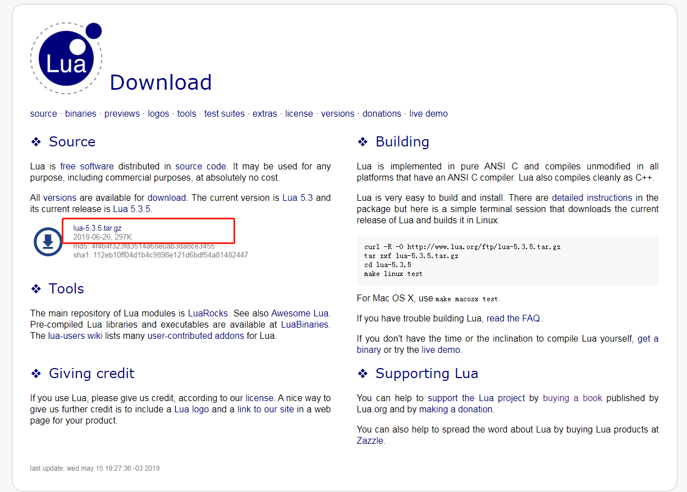
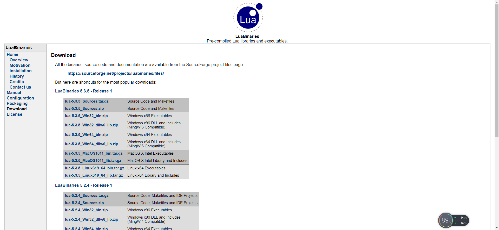
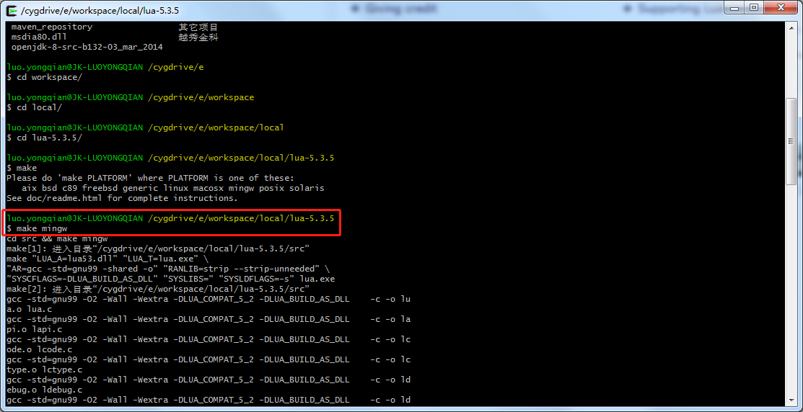
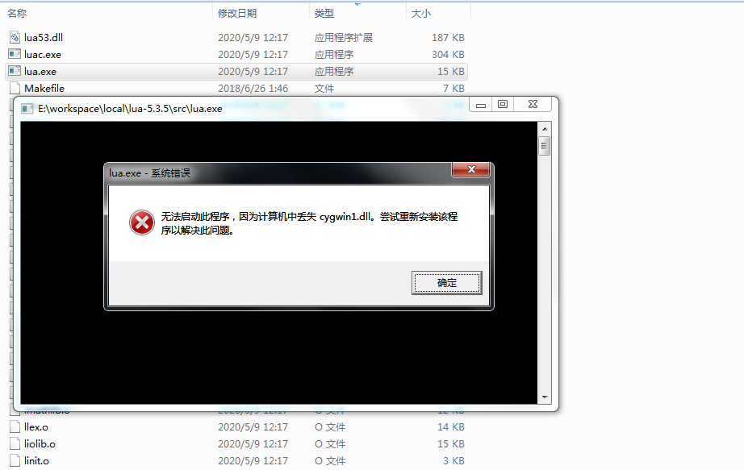
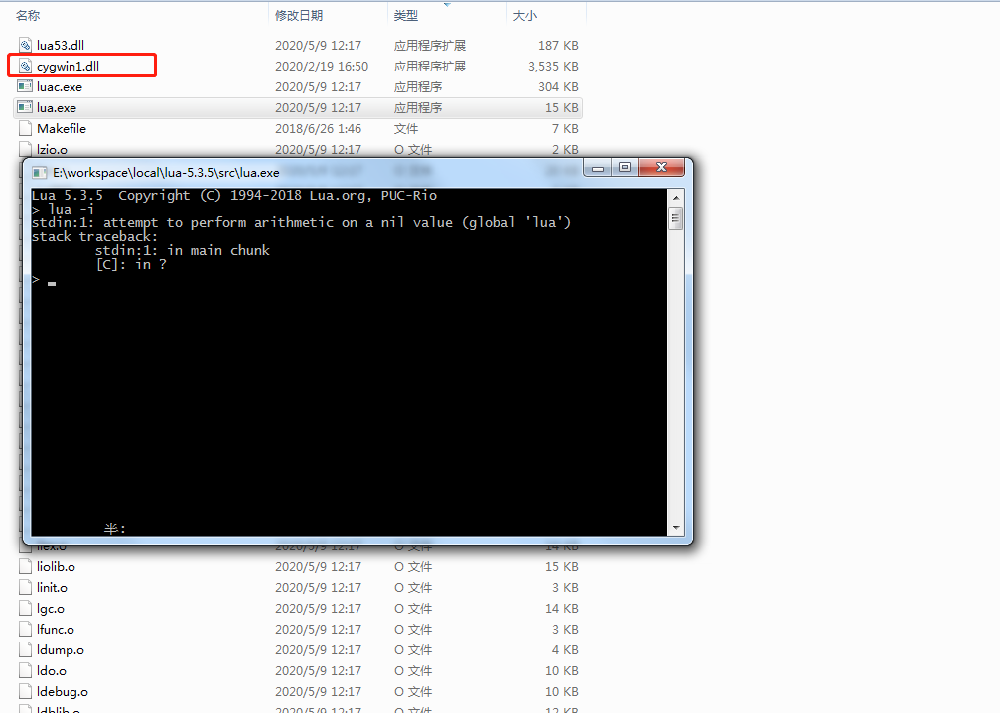
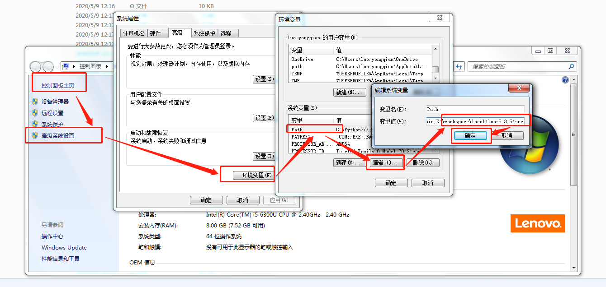
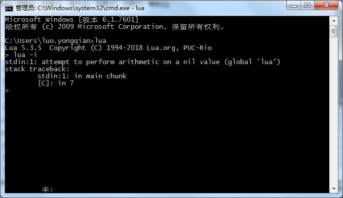
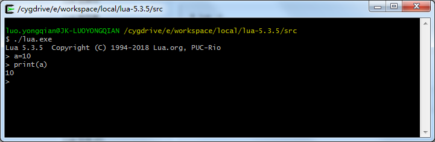
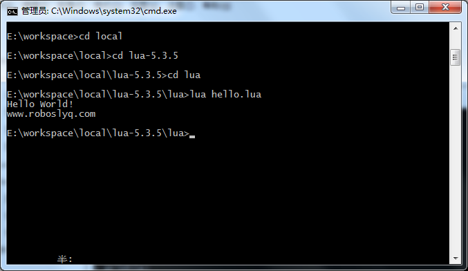
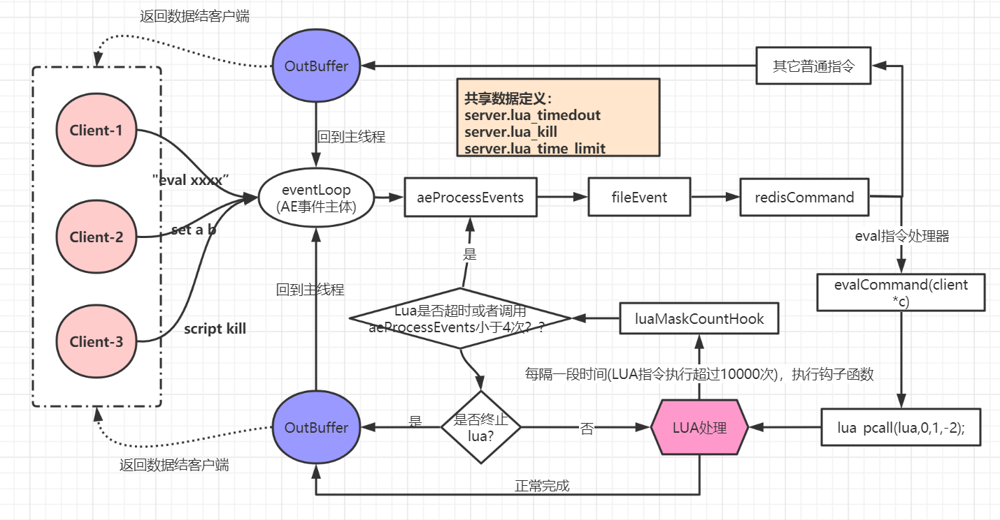

# Redis之Lua

# Lua基本概念

>1. Lua 是一个小巧的[脚本语言](https://www.baidu.com/s?wd=脚本语言&tn=SE_PcZhidaonwhc_ngpagmjz&rsv_dl=gh_pc_zhidao)。来 其设计目的是为了嵌入应用程序中，从而为应用程序提供灵活的扩展和定制功能。Lua由标准C编写而成，几乎在所有[操作系统](https://www.baidu.com/s?wd=操作系统&tn=SE_PcZhidaonwhc_ngpagmjz&rsv_dl=gh_pc_zhidao)和平台上都可以编译，运行。Lua并没有提供强大的库，这是由它的定位决定的。Lua 有一个同时进行的JIT项目，提供在特定平台上的即时编译功能。
>2. Lua脚本可以很容易的被[C/C++](https://www.baidu.com/s?wd=C%2FC%2B%2B&tn=SE_PcZhidaonwhc_ngpagmjz&rsv_dl=gh_pc_zhidao) 代码调用源，也可以反过来调用[C/C++](https://www.baidu.com/s?wd=C%2FC%2B%2B&tn=SE_PcZhidaonwhc_ngpagmjz&rsv_dl=gh_pc_zhidao)的函数，这使得Lua在应用程序中可以被广泛应用。不仅仅作为扩展脚本，也可以作为普通的配置文件，zhidao代替XML,ini等文件格式，并且更容易理解和维护。 Lua由标准C编写而成，代码简洁优美，几乎在所有[操作系统](https://www.baidu.com/s?wd=操作系统&tn=SE_PcZhidaonwhc_ngpagmjz&rsv_dl=gh_pc_zhidao)和平台上都可以编译，运行。一个完整的Lua解释器不过200k，在目前所有脚本引擎中，Lua的速度是最快的。

总结:

- lua是一门新的解释型语言
- lua的解释器是用标准的c语言写的
- 因为解释器是标准C写的,所以可以很方便的与C语言进行集成,很容易被C/C++调用,也很容易调用C库

## Lua环境搭建(windows)

> 前提：安装好cygwin,具体安装就不详细解释了，请百度。

​	官网地址： https://www.lua.org/download.html ，很小，才200多K。



> 当然可以点击"get a binary"获取已经编译好的版本
>
> 

​	下载完成后解压


> **lua静态库**：在VS下新建工程，选择生成静态库、不需要预编译头，包含src的文件，除了lua.c、luac.c
> **lua编译器**：在VS下新建工程，选择生成控制台工程，包含src的文件，除了lua.c
> **lua解释器**：在VS下新建工程，选择生成控制台工程，包含src的文件，除了luac.c

打开cygwin,进入解压目录 ，然后输入make编译



> lua编译需要指定平台，此处我是在windows下模块，选择mingw平台。

编译完成后，会生成exe文件，双击运行



> 缺少cygwin1.dll，将cygwin安装路径下bin目录的文件cygwin1.dll文件copy到当前目录即可。



## 环境变量配置

如果想在cmd环境正常使用lua命令，则需要配置相关环境变量



配置好后，测试结果如下：



## 交互式编程

直接启动lua.exe客户端，在界面输入相关命令，即可正常输出。



> ./lua.exe是正常make之后生成的可执行文件

## 脚本式编程

新建脚本文件，以.lua结尾


编辑.lua文件

```lua
print("Hello World！")
print("www.roboslyq.com")
```

运行




# Lua怎么与C交互

最近lua很火，因为《愤怒的小鸟》使用了lua，ios上有lua解释器？它是怎么嵌入大ios中的呢？lua的官网说："lua is an embeddable scripting language"，怎么理解呢？怎么在你自己的程序里嵌入lua解释器呢？如果可以在我的程序中嵌入了lua，那是否意味着我可以从此用lua编程了呢？

带着这些问题，打算在我的windows笔记本上做个实验，目标是在windows上跑一个lua的解释器，然后用lua语言写一个程序，跑在这个解释器之上，也就说最后的效果是:

（上） lua program -> lua解释器 -> windows （下）

或者是：

（上） lua program -> lua解释器 -> my c program -> windows （下）

实践：

1） 下载lua源码；

2） 用eclipse+mingw编译lua解释器的源码

eclipse+mingw编译环境我之前就已经搭好了，有兴趣的同学可以参考我的另一篇文章，当然你也可以用其他编译工具，比如visual Studio；

建立一个空白c工程，project type选Executable->Empyt Project；

导入src目录下的所有文件，包括.c, .h和Makefile文件；

点击build，开始编译；

遇到编译错误：main()重定义，lua.c和luac.c里分别有一个main()，lua.c是解释器的源码，luac.c是编译器的源码，我们此时要的是解释器，所以从工程删除luac.c，重新编译，通过，生成lua.exe；

没想到lua的源码和Makefile写得这么好，这么顺利就编译通过了，网上说lua是用标准c写的，只要是支持标准c的编译环境都能顺利的编译它；

3） 运行编译出来的解释器

找到lua.exe所在的目录，在这个目录下先准备一个用lua写的程序，比如hello.lua，包含代码：print "hello lua"；

打开一个windows的cmd窗口，cd到编译结果lua.exe所在的目录，调用lua解释器，执行hello.lua程序，命令为：lua.exe "hello.lua"，（我之前从官网下载了一个编译好的lua解释器和SciTE编辑器，我看到SciTE编辑器就是用这个命令调用lua解释器的）看到窗口输出hello lua，太好了，至此，我亲手编出了一个lua解释器，可以跑在我的windows系统之上；

4） 下一步，怎么在我的c程序里调用lua解释器？

哦，知道了，我的c程序调用windows的接口将lua.exe跑起来，同时把hello.lua文件作为参数传给lua.exe，不就行了。

在你的main.c中，可以用类似这样的代码调用lua.exe：system("C:\\some_path\\lua.exe -e \"hello.lua\" " )

5） lua解释器执行hello.lua的时候，如果hello.lua想调用一个本地库foo.dll中的foo()函数，foo.dll是foo.c编译生成的，怎么办？

稍等，我正在做...

6) foo.c怎么调用hello.lua中的函数？

写到这儿，突然明白了，解释型语言和编译型语言之间的相互调用没什么神秘的，还是以lua和c为例，

a）先看lua怎么调c？

所谓的lua调用c，是指foo.lua调用bar.c中的代码，foo.lua本身只是一段源码，不能执行的，必须由lua解释器来执行，lua解释器是一个可执行程序，可以运行，foo.lua可以看成是解释器程序运行过程中读取的一个配置文件，根据”配置文件foo.lua“内容的不同做不同的事情，如果”配置文件foo.lua“说调用bar.c中的bar()函数，那么解释器lua.exe就去调用了，假设此时bar.c也已经编译成了二进制bar.dll，那既然lua.exe和bar.dll是同一个平台（比如windows）上的二进制程序，互相之间的调用就没什么稀奇了吧，就跟你写一个简单的main.exe调用bar.dll一样了；

b）再看c怎么调用lua？

所谓的c调用lua，是指foo.c调用bar.lua中的代码，我们先要把foo.c编译成一个可执行程序foo.exe，这样才能执行嘛，可是被调用方bar.lua只是一个包含lua代码的源文件，不是二进制的（我们现在是在讨论解释器，不考虑lua预编译成二进制的情况），无法调用，所以我们就要借用lua解释器了，所以整个流程就是：foo.exe -call-> lua解释器（可执行程序）-读取-> bar.lua，foo.exe其实只和lua解释器打交道，告诉它我要调用某个函数，然后由解释器负责去找到这个函数并调用；

综上，你会发现，不管是lua调c还是c调lua，他们都不是直接交互的，因为lua程序只是一堆”死“的源代码，像一个配置文件一样，不能执行的，所以就需要一个中间人”lua解释器“，只要c程序和lua解释器之间约定好接口，那么实现c和lua之间的调用就是很自然的事情了，没什么神秘的。

最后给出一个示意图：

一个用c写的程序，已经编译成二进制 <--> 用c写的lua解释器，已经编译成二进制 -> 一个lua写的程序，只能被解释器”被动“地读取，不能”主动“地执行

# Redis中的Lua

## 集成原理 

> 1、redis引入了Lua包，不需要独立安装Lua,详情见`deps/lua`路径下的源码，这个源码包就是lua的源码
>
> 2、redis对lua相关操作进行的封装，比如调用Lua,lua中调用redis中的指令，以及lua和redis的数据类型转换等。源码请见`scripting.c`文件

## scriptiong.c源码简单分析

> 这个源码文件很长，仅对其关键内容作简要解析

### 预处理

导入了Lua相关的头文件，这是标准的C中调用lua集成方式。

```c
#include "server.h"
#include "sha1.h"
#include "rand.h"
#include "cluster.h"
// 集成Lua
#include <lua.h>
#include <lauxlib.h>
#include <lualib.h>
#include <ctype.h>
#include <math.h>
```

### 源码结构

```c
//1、定义了一个ldbState结构体(LDB,LUA调试器相关??)
struct ldbState {
    connection *conn; /* Connection of the debugging client. */
    int active; /* Are we debugging EVAL right now? */
    int forked; /* Is this a fork()ed debugging session? */
    list *logs; /* List of messages to send to the client. */
    list *traces; /* Messages about Redis commands executed since last stop.*/
    list *children; /* All forked debugging sessions pids. */
    int bp[LDB_BREAKPOINTS_MAX]; /* An array of breakpoints line numbers. */
    int bpcount; /* Number of valid entries inside bp. */
    int step;   /* Stop at next line ragardless of breakpoints. */
    int luabp;  /* Stop at next line because redis.breakpoint() was called. */
    sds *src;   /* Lua script source code split by line. */
    int lines;  /* Number of lines in 'src'. */
    int currentline;    /* Current line number. */
    sds cbuf;   /* Debugger client command buffer. */
    size_t maxlen;  /* Max var dump / reply length. */
    int maxlen_hint_sent; /* Did we already hint about "set maxlen"? */
} ldb;

/* ---------------------------------------------------------------------------
 *2、定义了一些工具类 Utility functions.
 * ------------------------------------------------------------------------- */
/** sha1工具函数 */
void sha1hex(char *digest, char *script, size_t len) {
    ...
}
/* ---------------------------------------------------------------------------
 * 3、redis相关类型转换为lua的类型
   Redis reply to Lua type conversion functions.
 * ------------------------------------------------------------------------- */
char *redisProtocolToLuaType(lua_State *lua, char* reply) {
... ...
}
char *redisProtocolToLuaType_Int(lua_State *lua, char *reply) {... ... }
char *redisProtocolToLuaType_Bulk(lua_State *lua, char *reply) {... ...}
...
  /* ---------------------------------------------------------------------------
 * 4、Lua相关类型转换为redis对应的类型
 Lua reply to Redis reply conversion functions.
 * ------------------------------------------------------------------------- */
void luaReplyToRedisReply(client *c, lua_State *lua) {... ...}

/* ---------------------------------------------------------------------------
 * 5、Lua中可以使用的redis函数实现。即可以在Lua中，直接使用的redis函数
 	Lua redis.* functions implementations.
 * ------------------------------------------------------------------------- */
int luaRedisGenericCommand(lua_State *lua, int raise_error) {... ...}

/* redis.call() */
int luaRedisCallCommand(lua_State *lua) {
    return luaRedisGenericCommand(lua,1);
}

/* redis.pcall() */
int luaRedisPCallCommand(lua_State *lua) {
    return luaRedisGenericCommand(lua,0);
}
... ...
/* ---------------------------------------------------------------------------
 * 6、Lua引擎初始化
 	Lua engine initialization and reset.
 * ------------------------------------------------------------------------- */    
/** lua引擎初始化 */
void luaLoadLib(lua_State *lua, const char *libname, lua_CFunction luafunc) {
  lua_pushcfunction(lua, luafunc);
  lua_pushstring(lua, libname);
  lua_call(lua, 1, 0);
}

LUALIB_API int (luaopen_cjson) (lua_State *L);
LUALIB_API int (luaopen_struct) (lua_State *L);
LUALIB_API int (luaopen_cmsgpack) (lua_State *L);
LUALIB_API int (luaopen_bit) (lua_State *L);

void luaLoadLibraries(lua_State *lua) {
    luaLoadLib(lua, "", luaopen_base);
    luaLoadLib(lua, LUA_TABLIBNAME, luaopen_table);
    luaLoadLib(lua, LUA_STRLIBNAME, luaopen_string);
    luaLoadLib(lua, LUA_MATHLIBNAME, luaopen_math);
    luaLoadLib(lua, LUA_DBLIBNAME, luaopen_debug);
    luaLoadLib(lua, "cjson", luaopen_cjson);
    luaLoadLib(lua, "struct", luaopen_struct);
    luaLoadLib(lua, "cmsgpack", luaopen_cmsgpack);
    luaLoadLib(lua, "bit", luaopen_bit);

#if 0 /* Stuff that we don't load currently, for sandboxing concerns. */
    luaLoadLib(lua, LUA_LOADLIBNAME, luaopen_package);
    luaLoadLib(lua, LUA_OSLIBNAME, luaopen_os);
#endif
}
... ...
 /* ---------------------------------------------------------------------------
 * 7、EVAL 和SCRIPT命令实现
 * EVAL and SCRIPT commands implementation
 * ------------------------------------------------------------------------- */
sds luaCreateFunction(client *c, lua_State *lua, robj *body) {}
void luaMaskCountHook(lua_State *lua, lua_Debug *ar) {}
void prepareLuaClient(void) {}
void evalGenericCommand(client *c, int evalsha) {}
/**
 * eval命令入口
 * @param c
 */
void evalCommand(client *c) {}
/**
 * evalsha命令入口
 * @param c
 */
void evalShaCommand(client *c) {}
/**scripts  命令处理器*/
void scriptCommand(client *c) {}
/* ---------------------------------------------------------------------------
 * 8、LDB LUA的调试器
 * LDB: Redis Lua debugging facilities
 * ------------------------------------------------------------------------- */
```

## 使用方式

### eval命令

```sh
127.0.0.1:6379> eval 'while(true) do print("hello") end' 0
```

> 注意，上述命令会一直死循环，在redis控制台，不断打印hello

### redis-cli直接调用

先将lua命令写到文件中，比如`D:\workspace_c\lua_demo.lua`

```tiki wiki
return redis.call('set',KEYS[1],ARGV[1])
```

然后使用redis-cli调用

```sh
C:\Users\robos>redis-cli --eval D:\workspace_c\lua_demo.lua foo , bar
OK
C:\Users\robos>
```

### evalsha调用

> 先使用`script load`将命令，此时命令未执行，会返回一个长度为40(39 + ‘\0’)的sha结果。然后调用evalsha

```shell
127.0.0.1:6379> script load  'while(true) do print("hello") end'
"d395649372f578b1a0d3a1dc1b2389717cadf403"
127.0.0.1:6379> evalsha "d395649372f578b1a0d3a1dc1b2389717cadf403" 0
```


## Redis中Lua处理流程



> 以上所有操作均在一个单线程中完成，即redis的main线程中
>
> 1、Client-1发起一个eval指令，指令经过LUA处理后，正常完成，返回客户端，不会执行其它相关。此时Client-1正常接收Lua执行结果
>
> 2、如果Client-1执行的时间长(指令次数超过10000次)，则执行钩子函数(redis中)，此钩子函数会检查Lua是不是已经超过规定时长(sever.lua_time_limit)，如果是则更新server.lua_timedout为1。如果不是，则继续执行LUA脚本处理。如果已经超时，则会调起aeProcessEvents处理事件(会循环调用4次)。此时，虽然LUA脚本阻塞，但允许有机会处理其它事件。
>
> 3、在前提2中，如果Client-2主发起Set操作指令，即使前面有LUA脚本指令在执行导致阻塞，但因钩子函数luaMaskCountHook，仍有机会处理Client-2的事件。
>
> 此时，Client-2在指令处理方法processCommand()中会检查lua_timedout，如果是并且不是script kill，shutdown 等个别指令，直接响应异常"-BUSY Redis is busy running a script. You can only call SCRIPT KILL or SHUTDOWN NOSAVE.“。即Client-2的指令不能正处理。
>
> 4、此时，Client-3可以正常连接，并且发起"script kill”或者 "shutdown nosave"，与Client-2原理一样，即使LUA脚本阻塞线程仍有机会处理。检测到是指令script kill，则将server.lua_kill 设置为1。此时，立刻响应客户端2。
>
> 5、当LUA继续调用钩子函数时，此时可以得到Client_3已经将server.lua_kill设置为1了，所以LUA会终止执行。此时，redis的eventLoop回归正常，不会阻塞。

## 常见应用场景 

###　分布式锁


# 参考资料

 [解释型语言和编译型语言如何交互？以lua和c为例](https://www.cnblogs.com/wangchengfeng/p/3716821.html)

 https://blog.csdn.net/follow_blast/article/details/81735632 

 https://segmentfault.com/a/1190000022162774 

https://www.cnblogs.com/bibi-feiniaoyuan/p/9448621.html

https://blog.csdn.net/qq_41453285/article/details/103473400

[redis中的lua(较详细)](https://my.oschina.net/floor/blog/1603116)

[官方关于redis的lua的数据](https://redis.io/commands/eval) 

[官方关于ldb调试的说明](https://redis.io/topics/ldb) 

[极客学院的lua介绍](http://wiki.jikexueyuan.com/project/redis/lua.html)

[importnew关于lua的介绍](http://www.importnew.com/24124.html)

https://blog.csdn.net/qq_39954022/article/details/77866166

[lua下主从复制](https://blog.csdn.net/li123128/article/details/102905891)

[Redis脚本复制械](https://developer.aliyun.com/article/726409)