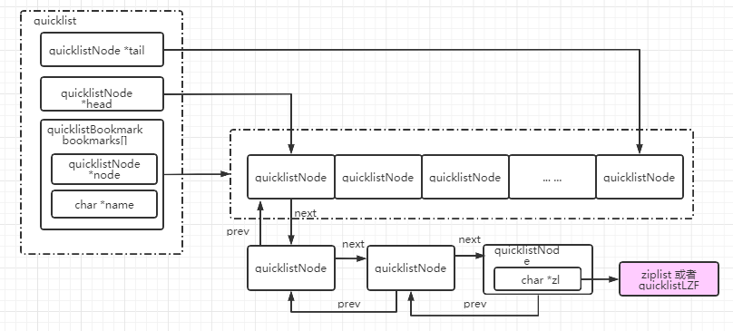

# Redis之数据结构与编码实现

> 在本章节正式开始之前，我觉得有必要单独的介绍一下SDS(Simple Dynamic String)。因为SDS是Redis底层数据结构实现，是对字符串的封装，是Redis中的字符串默认保存的数据结构。

## 1. SDS

redis对C语言的原生字符串进行了相关扩展，但又兼容原生字符串的大部分操作。那么为什么要对C语言的原生char进行扩展呢？因为c语言中没有String(字符串)这个概念，对String的操作均是通过字符数组来完成的。

通常，c的字符数组定义如下：

```c
char str[] = "hello，world"; 
strlen(str); 
```

上述原生C语言的字符数组存在以下缺陷：

1、求字符数组的长度，时间复杂度是O(n)

2、不能动态扩容

3、不能预分配空间

因为字符串使用实在是太频繁了，所以有必要对其进行优化一下。

### 1.1. sdshdr结构体

SDS (Simple Dynamic String)，Simple的意思是简单，Dynamic即动态。String是字符串的意思。是Redis对C语言原生的字符数组一种扩展包装。由Redis作者antirez创建，目前已经有一个独立[项目]( https://github.com/antirez/sds)。

sds 有两个版本，在Redis 3.2之前使用的是第一个版本，其数据结构如下所示：

```c
typedef char sds;      
struct sdshdr {
    unsigned int len;   //buf中已经使用的长度（4Byte）
    unsigned int free;  //buf中未使用的长度（4Byte）
    char buf[];         //柔性数组buf（0Byte）
};

```

在3.2之后，为了更细致控制内存，防止内存浪费，对数据结构进行了更细致的划分，详情如下：

```c
struct __attribute__ ((__packed__)) sdshdr5 {
    unsigned char flags; 
    char buf[];
};
// sdshdr8:
struct __attribute__ ((__packed__)) sdshdr8 {
    uint8_t len; 			// （1Byte）
    uint8_t alloc;			// （1Byte）
    unsigned char flags;  	// （1Byte）
    char buf[];  
};
struct __attribute__ ((__packed__)) sdshdr16 {
    uint16_t len;  
    uint16_t alloc; /* excluding the header and null terminator */
    unsigned char flags; /* 3 lsb of type, 5 unused bits */
    char buf[];
};
struct __attribute__ ((__packed__)) sdshdr32 {
    uint32_t len; /* used */
    uint32_t alloc; /* excluding the header and null terminator */
    unsigned char flags; /* 3 lsb of type, 5 unused bits */
    char buf[];
};
struct __attribute__ ((__packed__)) sdshdr64 {
    uint64_t len; /* used */
    uint64_t alloc; /* excluding the header and null terminator */
    unsigned char flags; /* 3 lsb of type, 5 unused bits */
    char buf[];
};
```

上述源码用图表示如下：


- **len**:  表示当前sds的长度(单位是字节),包括'0'终止符，通过len直接获取字符串长度，不需要扫一遍string。

- **alloc**： 表示已为sds分配的内存大小(单位是字节),(3.2以前的版本用的free是表示还剩free字节可用空间)，不包括'0'终止符

- **flags**:用一个字节表示当前sdshdr的类型，因为有sdshdr有五种类型，所以至少需要3位来表示000:sdshdr5 ， 001:sdshdr8，010:sdshdr16，011:sdshdr32，100:sdshdr64。高5位用不到所以都为0。

- **buf[]**: sds实际存放的位置(本质是一个char数组)。**关键：** 这个字符数组也是暴露给用户的地址。但是，在创建sds时，已经把完整的`sdshdr`结构创建出来了，因此，可以通过向前(左)偏移，得到len,alloc,flags这些类型。

所以，redis的SDS是通过给char[] 添加了三种重要的标识len,alloc及flags，使得各种操作十分方便快捷，起到了空间换时间的作用。

1、求字符数组的长度，时间复杂度是O(1)，因为有字段记录了数组的长度

2、可以实现动态扩容和预分配空间，因为有len和alloc两属性，因此很方便的求出空闲属性alloc - len

3、因为有了len与alloc属性，预分配空间，惰性释放等均可以实现。

4、一个神奇的实现是SDS实现返回的不是sdshdr结构体，而是sdshdr->buf?为何这样实现？因为这些实现就可以完全兼容标准C语言的常见字符串方法。因为sdshdr->buf就是一样char[]数组。

## 2. redisObject对象

redis对所有的对象的操作，不是直接的，而是通过redisObject对象进行包装。

```c
typedef struct redisObject {
    unsigned type:4;		//（4Byte）
    unsigned encoding:4;	//（4Byte）
    unsigned lru:LRU_BITS; /* LRU time (relative to global lru_clock) or
                            * LFU data (least significant 8 bits frequency
                            * and most significant 16 bits access time). */
    					  //（4Byte）
    int refcount;		  //（4Byte）
    void *ptr;
} robj;
```

通过redisObject包装，可以精确的对编码实现控制，从而对内存的使用达到最优化。

> **type** : 对象的类型，面向用户的。旧版本也就是我们说的 string、list、hash、set、zset中的一种，可以使用命令 TYPE key 来查看。新版本加了两种：modules和stream
>
> **encoding**:
>
> ​		encoding属性记录了队形所使用的编码(底层数据结构)，即这个对象底层使用哪种数据结构实现。详情见下面定义的OBJ_ENCODING_XXX。
>
> encoding可以根据不同的使用场景来为一个对象设置不同的编码，从而优化在某一场景下的效率，极大的提升了 Redis 的灵活性和效率。可以通过函数strEncoding()来获取具体的编码方式
>
> **lru**:  LRU是`Least Recently Used`的缩写，即最近最少使用 。这个属性记录了对象最后一次被访问的时间。常见的淘汰策略除了LRU，还有如下两种：
>
> FIFO：First In First Out，先进先出。判断被存储的时间，离目前最远的数据优先被淘汰。
> LFU：Least Frequently Used，最不经常使用。在一段时间内，数据被使用次数最少的，优先被淘汰。
>
> **refcount**:    键值对对象的引用统计。当此值为 0 时，回收对象。
>
> ***ptr**:指向底层实现数据结构的指针,就是实际存放数据的地址。具体实现由 type + encoding组合实现

**对象类型**

```c
/* The actual Redis Object */
/** 五种数据结构,与redisObject->type对应 */
#define OBJ_STRING 0    /* String object. */
#define OBJ_LIST 1      /* List object. */
#define OBJ_SET 2       /* Set object. */
#define OBJ_ZSET 3      /* Sorted set object. */
#define OBJ_HASH 4      /* Hash object. */

/* The "module" object type is a special one that signals that the object
 * is one directly managed by a Redis module. In this case the value points
 * to a moduleValue struct, which contains the object value (which is only
 * handled by the module itself) and the RedisModuleType struct which lists
 * function pointers in order to serialize, deserialize, AOF-rewrite and
 * free the object.
 * Inside the RDB file, module types are encoded as OBJ_MODULE followed
 * by a 64 bit module type ID, which has a 54 bits module-specific signature
 * in order to dispatch the loading to the right module, plus a 10 bits
 * encoding version. */
//后续Redis版本新境的数据结构
#define OBJ_MODULE 5    /* Module object. */
#define OBJ_STREAM 6    /* Stream object. */

```

**编码方式**

```c
/** 对象类型对应的编码定义，与struct redisObject中的encoding对应 */
#define OBJ_ENCODING_RAW 0     /* Raw representation 简单动态字符串*/
#define OBJ_ENCODING_INT 1     /* Encoded as integer Long类型整数*/
#define OBJ_ENCODING_HT 2      /* Encoded as hash table HashTable简写，即字典*/
#define OBJ_ENCODING_ZIPMAP 3  /* Encoded as zipmap */
#define OBJ_ENCODING_LINKEDLIST 4 /* No longer used: old list encoding. */
#define OBJ_ENCODING_ZIPLIST 5 /* Encoded as ziplist 压缩列表*/
#define OBJ_ENCODING_INTSET 6  /* Encoded as intset 整数集合*/
#define OBJ_ENCODING_SKIPLIST 7  /* Encoded as skiplist  跳跃列表和字典 */
#define OBJ_ENCODING_EMBSTR 8  /* Embedded sds string encoding emb编码的简单动态字符串 */
#define OBJ_ENCODING_QUICKLIST 9 /* Encoded as linked list of ziplists  */
#define OBJ_ENCODING_STREAM 10 /* Encoded as a radix tree of listpacks */
```

> 由对象类型 + 对象编码 决定一种具体的编码实现。

## 3、编码方式实现

> 在redis中，编码方式的实现是基于SDS + redisObject基础之上

### 3.1 RAW

> 即普通的字符串，基于SDS存储实现。用于存储普通字符串，字符串长度超过44(不同版本阀值不一样，低版本可能为39)。具体修改原因可以参考文章：[Redis的embstr与raw编码方式不再以39字节为界了！](https://blog.csdn.net/XiyouLinux_Kangyijie/article/details/78045385 ) 
>

### 3.2 EMBSTR

> 前提知识：
>
> 1、redis采用的是jemalloc内存分配器，可以分配8,16,32,64字节等大小的内存。所以当分配的内存大于32时，最小的分配单位是64。这个64很关键！！！
>
> 2、redisObject大小为16字节

embstr,嵌入式String， 是一块连续的内存区域，由redisObject和sdshdr组成。

**旧版本**

> sizeof(sdshrd) =  64 - sizeof(redisObject) = 64 - 16 = 48。
>
> 在64字节内，max(sizeof(sdshdr)) = 48 - sizeof(sdshdr->header) = 48 - 4 - 4 - 1= 39。
>
> 其中，最后一个1是 '\0',是结束标识符。 因而，对于redis来说小于等于39字节的字符串采用embstr编码，大于则用raw编码。

**新版本**

> 新版本（sdshdr8）：sdshdr的大小为1+1+1+buf+1,redisObject不变。所以如果还是需要按64大小分配内存时，buf=44。因为，小于等于44字节的字符串采用embstr编码，大于则用raw编码。


**embstr优点**

embstr编码是专门用于保存短字符串的一种优化编码方式，跟正常的字符编码相比有以一优点：

1. 内存连续，从而内存碎片化少。
2. 相对于其它的字符编码会调用两次内存分配函数来分别创建redisObject和sdshdr结构，而embstr编码则通过调用一次内存分配函数来分配一块连续的空间，空间中一次包含redisObject和sdshdr两个结构。


### 3.3 INT

> 当值可以转换为整数时(比如“123”,"3223")等

### 3.4 ZIPLIST

官方定义结构：


**enrty**结构


prevrawlensize: 前置节点的“prelen”大小，根据具体编码规则可以为1或者5。图中对于enrty2来说，prevrawlensize即对应entry1的lensize。

prevrawlen:前置节点长度，即整个前置entry(prevlen + encoding + entry-data)大小。图中对于enrty2来说，prevrawlensize即对应entry1的len。

lensize:当前节点的长度编码空间，根据具体编码规则可以为1或者5。图中对于enrty2来说，prevrawlensize即对应entry1的lensize。

len:当前节点长度，即整个前置entry(prevlen + encoding + entry-data)大小。图中对于enrty2来说，prevrawlensize即对应entry1的len。

encoding:当前节点编码方式，是一个unsigned char类型。有很多种， ZIP_STR_* or ZIP_INT_*。

*p:指向节点保存的具体数据。

> 上述只是粗略描述，具体的ziplist编码很灵活，细节实现可能不一样。比如lensize小于254和大于254这两种情况。

**encoding**

> encoding 是一个`char`，长度是8bit。
>
> 高位2bit很重要，它代表了后面data的编码类型。
>
> - 00 ： 格式为|00pppppp| ，表示后面6位表示string长度，此时，value的最大长度0b00111111 = 63(Byte)。此时encoding + value布局如下：|00pppppp|string
>
>   例如: encoding = 5,二进制为0b00000101。*p指向长度为5个字节的字符串即可，例如'abcde'。
>
> - 01：格式为|00pppppp| ，使用两个字节表示字符串的长度。即 ppppppqqqqqqqq 共14 bit位表示 字符串长度。2^14  = 1024 * 16 = 16KB。此时，可以描述最长字符串为16KB。
>
> - 10:格式为 10000000|qqqqqqqq|rrrrrrrr|ssssssss|tttttttt| 。故一共有4*8 位(bit)，故可以描述长度为2^32 - 1 字节的字符串。此中，第1个字节中的低6位没有使用，空闲。
>
> - 11:表时是数字编码，
>
>   - |11000000| - 总长度为3 Byte,后面紧跟2Byte用来表述整数长度。因此，可以描述 16位整数，即 11000000 xxxxxxxx xxxxxxxx
>   - |11010000| - 5 bytes   32位整数， 即 11010000  xxxxxxxx xxxxxxxx xxxxxxxx xxxxxxxx
>   - |11100000| - 9 bytes   64位整数， 即 11100000  xxxxxxxx xxxxxxxx xxxxxxxx xxxxxxxx xxxxxxxx xxxxxxxx xxxxxxxx xxxxxxxx
>   -  |11110000| - 4 bytes   24位有符号整数  即 11110000  xxxxxxxx xxxxxxxx xxxxxxxx
>   - |11111110| - 2 bytes  8位有符号整数  即 11111110  xxxxxxxx
>   - |1111xxxx| -         xxxx就是范围，在0000和1101，因为0000和1110（2bytes,8位有符号整数）已经在上面被编码了，所以表面xxxx的值是0001到1101，共13个。
>   - |11111111| - 即0XFF,ziplist的 结束标识符

**ziplist**相关操作

基于上述数据结构，ziplist可以实现以下常用的操作;

- push
  - 有两种方式ZIPLIST_ENTRY_END 和 ZIPLIST_ENTRY_HEAD,即头插法和尾插法。
- next
- prev
- get
- insert
- delete
- find
- merge
- 

### HT

### ZIPMAP

### LINKEDLIST

### INTSET

### SKIPLIST

### QUICKLIST

### STREAM

TODO

## 2.  String类型

> 即当redisObject->type = String 时

###　2.1 INT

> redisObject->encoding=OBJ_ENCODING_INT

场景：保存的string是纯数字时

### 2.2  EMBSTR

>   redisObject->encoding=OBJ_ENCODING_EMBSTR

在redisObject基础之上，如果type是一个string并且长度小于44,则采用embstr 编码。

此时*ptr与redisObject内存连续，此时ptr指向一个sds结构体。

场景：string长度小于44时。

###　2.3 RAW

>  redisObject->encoding=OBJ_ENCODING_RAW

在redisObject基础之上，如果type是一个string并且长度大于44,则采用Raw编码。

此时ptr与redisObject内存不连续。此时*ptr指向一个sds结构体

场景：普通的String，长度大于等于44。

## 3. List

### 3.1 LINKEDLIST(低版本)

>  OBJ_ENCODING_LINKEDLIST 

### 3.2 ZIPLIST(低版本)

>  OBJ_ENCODING_ZIPLIST 

### 3.3 QUICKLIST

> 定义在`quicklist.h`中，现版本中的List均是通过quickList实现。

> 如果是普通的双向链表，prev 和 next 指针就要占去 16 个字节 (64bit 系统的指针是 8 个字节)，空间成本太高。另外每个节点的内存都是单独分配，会加剧内存的碎片化，影响内存管理效率。
>
> 因此redis对列表数据结构进行了改造，使用 quicklist 代替了 ziplist 和 linkedlist。经过改造的quickList 功能是 zipList 和 linkedList 的混合体，它将 linkedList 按段切分，每一段使用 zipList 来紧凑存储，多个 zipList 之间使用双向指针串接起来。



## 4. Hash

### 4.1 ZIPLIST

>  OBJ_ENCODING_ZIPLIST 

场景：数据量少，遍列实现，因为数量小，所以遍列性能较高。通过`server.hash_max_ziplist_value`参数来控制是否需要将ZIPLIST编码转换为HT编码。

```powershell
127.0.0.1:6379> hset book a b
(integer) 1
127.0.0.1:6379> hset book c d
(integer) 1
127.0.0.1:6379> object encoding book
"ziplist"
127.0.0.1:6379> hset book c xxxxxxxxxxxxxxxxxxxxxxxxxxxxxxxxxxxxxxxxxxxxxxxxxxxxxxxxxdddddddddddddddddddddddddddddddddddddddddd
(integer) 0
127.0.0.1:6379> object encoding book
"hashtable"
127.0.0.1:6379>                                                                                                         
```

> 其中xxx...ddd是我随便输入的测试字符串，没有什么特殊含义。

### 4.2 HT

>  OBJ_ENCODING_HT ,hashtable

## 5. SET

### 5.1 INTSET

>  OBJ_ENCODING_INTSET

当SET中为纯数字时，使用INTSET编码，如果SET中包含了字符，则使用HT编码。

```shell
127.0.0.1:6379> sadd book1 212
(integer) 1
127.0.0.1:6379> sadd book1 222
(integer) 1
127.0.0.1:6379> sadd book1 223
(integer) 1
127.0.0.1:6379> object encoding book1
"intset"
127.0.0.1:6379> sadd book1 223b
(integer) 1
127.0.0.1:6379> object encoding book1
"hashtable"
127.0.0.1:6379> a                                                                                                       
```

### 5.2 HT

>  OBJ_ENCODING_HT ,hashtable


## 6. ZSET

### 6.1 ZIPLIST

>  OBJ_ENCODING_ZIPLIST 

### 6.2 SKIPLIST

>  OBJ_ENCODING_SKIPLIST 

## 7.MODULES

TODO

## 8. Stream

TODO

## 9.其它扩展结构

> 其它是指没有定义对应的OBJ_XXX和OBJ_ENCODING_XXX

### 9.1 bitmap

### 9.2 GeoHash

### 9.3 HyperLogLog
