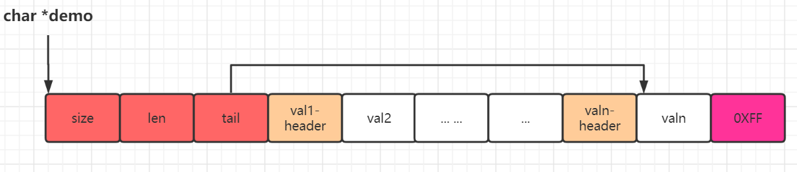

# Redis之数据结构与编码实现

## Redis简介

在讲Redis的数据结构与编码之前，我们先来看看redis首页(Redis中文网)对自己的[介绍 ](http://www.redis.cn/)：

> redis 是一个开源（BSD许可）的，**内存**中的**数据结构**存储系统，它可以用作**数据库**、**缓存**和**消息中间件**。 它支持多种类型的数据结构，如 [字符串（strings）](http://www.redis.cn/topics/data-types-intro.html#strings)， [散列（hashes）](http://www.redis.cn/topics/data-types-intro.html#hashes)， [列表（lists）](http://www.redis.cn/topics/data-types-intro.html#lists)， [集合（sets）](http://www.redis.cn/topics/data-types-intro.html#sets)， [有序集合（sorted sets）](http://www.redis.cn/topics/data-types-intro.html#sorted-sets) 与范围查询， [bitmaps](http://www.redis.cn/topics/data-types-intro.html#bitmaps)， [hyperloglogs](http://www.redis.cn/topics/data-types-intro.html#hyperloglogs) 和[地理空间（geospatial）](http://www.redis.cn/commands/geoadd.html) 索引半径查询。 Redis 内置了 [复制（replication）](http://www.redis.cn/topics/replication.html)，[LUA脚本（Lua scripting）](http://www.redis.cn/commands/eval.html)， [LRU驱动事件（LRU eviction）](http://www.redis.cn/topics/lru-cache.html)，[事务（transactions）](http://www.redis.cn/topics/transactions.html) 和不同级别的 [磁盘持久化（persistence）](http://www.redis.cn/topics/persistence.html)， 并通过 [Redis哨兵（Sentinel）](http://www.redis.cn/topics/sentinel.html)和自动 [分区（Cluster）](http://www.redis.cn/topics/cluster-tutorial.html)提供高可用性（high availability）。

上面的这一段描述虽然不很长，但基本上把redis主要特性都说清楚。上面的每一个名词基本都对应一个知识点，如果深究，每一个都可以写一篇很长的文章。

在这里我们只关注我们关心的数据结构相关部分。

- redis中一个k-v类型的数据结构(上面的话语好像没有说明这点，但大家都知道滴，因为redis就是`REmote DIctionary Server`简称，翻译过来就是"远程字典服务器")。因为是一个K-V结构的字典服务器，所以理所当然的使用字典(dict)这一数据结构实现rdb(redis db)。即redis中dict这种数据结构可以用来实现DB。
- redis的DB支持多种数据类型,即dict需要支持多种数据类型，所以我们需要有不同的类型。注意：此处的类型是向向用户的，所以有String hash,list,set,zset,bitmap,hyperloglog和geospatial等。
- 即然redis支持多种数据型 ，那么每种类型具体怎么编码实现，什么实现文案可以节省内存？什么文案可以减少内存碎片？什么方案可以快速查询对应的key-value？

### 节省内存

关键点，对每一种数据类型，选择相应的数据结构去实现，这样已经能达到节省内存的效果。但是还不够，即使是同一种数据类型，在数据量大和数据量小，保存的数据大小等不同场景下表现都不一样。那么能不能做到对一种数据类型实现多种编码，根据具体的实际情况使用不同的编码呢？当然可以，在redis中抽象出了redisObject这个结构体。redis的所有的key—value都会经过此结构包装访问。而不是直接访问。

```c
/*
 * =======>核心类，通过type与encoding组合，实现不同type的不同场景的不同编码，从而实现内存的存储优化。
 * 1、对五种基本对象（string、hash、list、set、sort set）进行包装。
 * 2、Redis没有直接使用（string、hash、list、set、sort set）这5类数据结构来实现键值对的数据库，而是统一通过redisObject实现。
 * */
typedef struct redisObject {
    unsigned type:4;// 对象的类型，也就是我们说的 string、list、hash、set、zset中的一种，可以使用命令 TYPE key 来查看。
    unsigned encoding:4;/* 1、encoding属性记录了队形所使用的编码(底层数据结构)，即这个对象底层使用哪种数据结构实现。详情见下面定义的OBJ_ENCODING_XXX
                        * 2、encoding可以根据不同的使用场景来为一个对象设置不同的编码，从而优化在某一场景下的效率，极大的提升了 Redis 的灵活性和效率。
                        * 3、可以通过函数strEncoding()来获取具体的编码方式
                        * */
    // 对象最后一次被访问的时间
    unsigned lru:LRU_BITS; /* LRU time (relative to global lru_clock) or
                            * LFU data (least significant 8 bits frequency
                            * and most significant 16 bits access time). */
    // 键值对对象的引用统计。当此值为 0 时，回收对象。
    int refcount;
    // 指向底层实现数据结构的指针,就是实际存放数据的地址。具体实现由 type + encoding组合实现
    void *ptr;
} robj;
```

> type对应着用户的类型比如string,list等，encoding对应着具体的编码实现。因此，即使是一个string，在长短不一样，或者是纯数字“123”这样的string，我们可以采用具体不同的编码方式来存储，从而实现内存优化。具体的细节下面再讲。
>

**总结：redis提供了多种数据类型供用户使用，为了最优的使用内存，同一种数据类型会根据实际情况采用多种不同的类型编码**。

### 内存优化

> 内存优化目标：
>
> 1、占用内存少
>
> 2、碎片率小
>
> 我们也可以自己思考，如果是我们自己，如果实现上面的目标?
>
> 在redis中，通**"约定"**相应的规则，然后加上相应的数据结构来实现。

下图是最常用的一种方式：


**len**:表示节点数，保存元素数量

**size**:占用字节数

**val1-len**: 其中val1表示第1个元素，len表第1个元素占用字节数，合起来就是第1个元素占用字节数。同理val2-len表示第2个字节数长茺。

**val1**:第一个元素具体的值。

1、定义一个char 数组 demo，约定第1个字节用来保存整个数组的长度(元素个数)。

2、第2个字节，约定使用一个字节来表示接下来的val1的长度(字节)，那么，val最大值可以保存256Bytes。

3、根据val1-len，可以推算出val2-len起始地址。*val2-len = *len + 1 +1+ val-len。即demo的起始地址 *len ，加上len本身占用的1个字节，加上val1-len本身占用的一个字节 ，加上val1内容占用的val1-len个字节。

4、当遇到0xFF表示结束（ 这个是约定，可以自己定义）。

> 上面的len,val1-len等长度是1字节还是多字节都可以约定，根据自己的需要扩展。这样的结构实现了内存连续，并且使用空间少(省略了prev,next指针)。并且求长度为1

我们可以在上述最简单的实现扩展：



1、添加了size和tail规范。size记录整个char数组占用字节数。tail直接向tail节点(指向具体的val或者是val-header，可以根据实际情况来定。因为定义好了规范，可以通过地址偏移计算得出相关地址)。

2、val1-header：即节点头。这个头我们又可以按照这个思想，约定很多内容。比如redis常用的，当value长度小于254时，只用一个字节(假如叫val-len)表示value长度。当value长度大于254时，val-len始终等于254,然后用后面4个字节表示value长度。

3、val-headerK ,当然也可以保存前置节点的len和val-header-len(头部长度)。那么就可以实现双向链表操作了。前后遍列均可以。

4、val可以为任何值，指针，结构体，普通字符，数字等

## 1. SDS

redis对C语言的原生字符串进行了相关扩展，但又兼容原生字符串的大部分操作。那么为什么要对C语言的原生char进行扩展呢？因为c语言中没有String(字符串)这个概念，对String的操作均是通过字符数组来完成的。

通常，c的字符数组定义如下：

```c
char str[] = "hello，world"; 
strlen(str); 
```

上述原生C语言的字符数组存在以下缺陷：

1、求字符数组的长度，时间复杂度是O(n)

2、不能动态扩容

3、不能预分配空间

因为字符串使用实在是太频繁了，所以有必要对其进行优化一下。

### 1.1. sdshdr结构体

SDS (Simple Dynamic String)，Simple的意思是简单，Dynamic即动态。String是字符串的意思。是Redis对C语言原生的字符数组一种扩展包装。由Redis作者antirez创建，目前已经有一个独立[项目]( https://github.com/antirez/sds)。

sds 有两个版本，在Redis 3.2之前使用的是第一个版本，其数据结构如下所示：

```c
typedef char sds;      
struct sdshdr {
    unsigned int len;   //buf中已经使用的长度（4Byte）
    unsigned int free;  //buf中未使用的长度（4Byte）
    char buf[];         //柔性数组buf（0Byte）
};

```

在3.2之后，为了更细致控制内存，防止内存浪费，对数据结构进行了更细致的划分，详情如下：

```c
struct __attribute__ ((__packed__)) sdshdr5 {
    unsigned char flags; 
    char buf[];
};
// sdshdr8:
struct __attribute__ ((__packed__)) sdshdr8 {
    uint8_t len; 			// （1Byte）
    uint8_t alloc;			// （1Byte）
    unsigned char flags;  	// （1Byte）
    char buf[];  
};
struct __attribute__ ((__packed__)) sdshdr16 {
    uint16_t len;  
    uint16_t alloc; /* excluding the header and null terminator */
    unsigned char flags; /* 3 lsb of type, 5 unused bits */
    char buf[];
};
struct __attribute__ ((__packed__)) sdshdr32 {
    uint32_t len; /* used */
    uint32_t alloc; /* excluding the header and null terminator */
    unsigned char flags; /* 3 lsb of type, 5 unused bits */
    char buf[];
};
struct __attribute__ ((__packed__)) sdshdr64 {
    uint64_t len; /* used */
    uint64_t alloc; /* excluding the header and null terminator */
    unsigned char flags; /* 3 lsb of type, 5 unused bits */
    char buf[];
};
```

上述源码用图表示如下：


- **len**:  表示当前sds的长度(单位是字节),包括'0'终止符，通过len直接获取字符串长度，不需要扫一遍string。

- **alloc**： 表示已为sds分配的内存大小(单位是字节),(3.2以前的版本用的free是表示还剩free字节可用空间)，不包括'0'终止符

- **flags**:用一个字节表示当前sdshdr的类型，因为有sdshdr有五种类型，所以至少需要3位来表示000:sdshdr5 ， 001:sdshdr8，010:sdshdr16，011:sdshdr32，100:sdshdr64。高5位用不到所以都为0。

- **buf[]**: sds实际存放的位置(本质是一个char数组)。**关键：** 这个字符数组也是暴露给用户的地址。但是，在创建sds时，已经把完整的`sdshdr`结构创建出来了，因此，可以通过向前(左)偏移，得到len,alloc,flags这些类型。

所以，redis的SDS是通过给char[] 添加了三种重要的标识len,alloc及flags，使得各种操作十分方便快捷，起到了空间换时间的作用。

1、求字符数组的长度，时间复杂度是O(1)，因为有字段记录了数组的长度

2、可以实现动态扩容和预分配空间，因为有len和alloc两属性，因此很方便的求出空闲属性alloc - len

3、因为有了len与alloc属性，预分配空间，惰性释放等均可以实现。

4、一个神奇的实现是SDS实现返回的不是sdshdr结构体，而是sdshdr->buf?为何这样实现？因为这些实现就可以完全兼容标准C语言的常见字符串方法。因为sdshdr->buf就是一样char[]数组。

### 1.2 dict结构体

`dict`在redis也sdshdr一样，也是一种非常重要的结构体。Redis的数据库就是基于dict的实现的。

关于`dict`结构定义如下：

```c
typedef struct dict {
    dictType *type; // 类型特定函数: type里面主要记录了一系列的函数,可以说是规定了一系列的接口
    // 私有数据
    void *privdata;// privdata保存了需要传递给那些类型特定函数的可选参数
    //两张哈希表【具体保存Redis数据】
    dictht ht[2];   //便于渐进式rehash
    //rehash 索引，并没有rehash时，值为 -1
    long rehashidx; /* rehashing not in progress if rehashidx == -1 */
    //目前正在运行的安全迭代器的数量
    unsigned long iterators; /* number of iterators currently running */
} dict;
```

`dictht`结构体

```c
// dictht 哈希表：每个字典都使用两个哈希表，从而实现渐进式 rehash
typedef struct dictht {         // 字典的头部
    dictEntry **table;          // 哈希表数组, 每个元素都是一条链表
    unsigned long size;         // 哈希表大小
    unsigned long sizemask;     // 哈希表大小掩码，用于计算索引值 总是等于 size - 1 此值和哈希值一起决定一个键应该被放到table数组的那个索引上面
    unsigned long used;         // 该哈希表已有节点的数量
} dictht;
```

`dictType`定义

```c
/**
 * 字典对应的字典类型
 */
typedef struct dictType {
    // 计算哈希值的函数
    uint64_t (*hashFunction)(const void *key);
    // 复制键的函数
    void *(*keyDup)(void *privdata, const void *key);
    // 复制值的函数
    void *(*valDup)(void *privdata, const void *obj);
    // 对比键的函数
    int (*keyCompare)(void *privdata, const void *key1, const void *key2);
    // 销毁键的函数
    void (*keyDestructor)(void *privdata, void *key);
    // 销毁值的函数
    void (*valDestructor)(void *privdata, void *obj);
} dictType;
```

**关于dictType常见实现**

`server.h`

```c
extern dictType objectKeyPointerValueDictType;
extern dictType objectKeyHeapPointerValueDictType;
extern dictType setDictType;
extern dictType zsetDictType;
extern dictType clusterNodesDictType;
extern dictType clusterNodesBlackListDictType;
extern dictType dbDictType;
extern dictType shaScriptObjectDictType;
extern dictType hashDictType;
extern dictType replScriptCacheDictType;
extern dictType keyptrDictType;
extern dictType modulesDictType;
```


## 2. redisObject对象

redis对所有的对象的操作，不是直接的，而是通过redisObject对象进行包装。

```c
typedef struct redisObject {
    unsigned type:4;		//（4Byte）
    unsigned encoding:4;	//（4Byte）
    unsigned lru:LRU_BITS; /* LRU time (relative to global lru_clock) or
                            * LFU data (least significant 8 bits frequency
                            * and most significant 16 bits access time). */
    					  //（4Byte）
    int refcount;		  //（4Byte）
    void *ptr;
} robj;
```

通过redisObject包装，可以精确的对编码实现控制，从而对内存的使用达到最优化。

> **type** : 对象的类型，面向用户的。旧版本也就是我们说的 string、list、hash、set、zset中的一种，可以使用命令 TYPE key 来查看。新版本加了两种：modules和stream
>
> **encoding**:
>
> ​		encoding属性记录了队形所使用的编码(底层数据结构)，即这个对象底层使用哪种数据结构实现。详情见下面定义的OBJ_ENCODING_XXX。
>
> encoding可以根据不同的使用场景来为一个对象设置不同的编码，从而优化在某一场景下的效率，极大的提升了 Redis 的灵活性和效率。可以通过函数strEncoding()来获取具体的编码方式
>
> **lru**:  LRU是`Least Recently Used`的缩写，即最近最少使用 。这个属性记录了对象最后一次被访问的时间。常见的淘汰策略除了LRU，还有如下两种：
>
> FIFO：First In First Out，先进先出。判断被存储的时间，离目前最远的数据优先被淘汰。
> LFU：Least Frequently Used，最不经常使用。在一段时间内，数据被使用次数最少的，优先被淘汰。
>
> **refcount**:    键值对对象的引用统计。当此值为 0 时，回收对象。
>
> ***ptr**:指向底层实现数据结构的指针,就是实际存放数据的地址。具体实现由 type + encoding组合实现

**对象类型**

```c
/* The actual Redis Object */
/** 五种数据结构,与redisObject->type对应 */
#define OBJ_STRING 0    /* String object. */
#define OBJ_LIST 1      /* List object. */
#define OBJ_SET 2       /* Set object. */
#define OBJ_ZSET 3      /* Sorted set object. */
#define OBJ_HASH 4      /* Hash object. */

/* The "module" object type is a special one that signals that the object
 * is one directly managed by a Redis module. In this case the value points
 * to a moduleValue struct, which contains the object value (which is only
 * handled by the module itself) and the RedisModuleType struct which lists
 * function pointers in order to serialize, deserialize, AOF-rewrite and
 * free the object.
 * Inside the RDB file, module types are encoded as OBJ_MODULE followed
 * by a 64 bit module type ID, which has a 54 bits module-specific signature
 * in order to dispatch the loading to the right module, plus a 10 bits
 * encoding version. */
//后续Redis版本新境的数据结构
#define OBJ_MODULE 5    /* Module object. */
#define OBJ_STREAM 6    /* Stream object. */

```

**编码方式**

```c
/** 对象类型对应的编码定义，与struct redisObject中的encoding对应 */
#define OBJ_ENCODING_RAW 0     /* Raw representation 简单动态字符串*/
#define OBJ_ENCODING_INT 1     /* Encoded as integer Long类型整数*/
#define OBJ_ENCODING_HT 2      /*  Encoded as hash table HashTable简写，即字典*/
#define OBJ_ENCODING_ZIPMAP 3  /* Encoded as zipmap */
#define OBJ_ENCODING_LINKEDLIST 4 /* No longer used: old list encoding. */
#define OBJ_ENCODING_ZIPLIST 5 /* Encoded as ziplist 压缩列表*/
#define OBJ_ENCODING_INTSET 6  /* Encoded as intset 整数集合*/
#define OBJ_ENCODING_SKIPLIST 7  /* Encoded as skiplist  跳跃列表和字典 */
#define OBJ_ENCODING_EMBSTR 8  /* Embedded sds string encoding emb编码的简单动态字符串 */
#define OBJ_ENCODING_QUICKLIST 9 /* Encoded as linked list of ziplists  */
#define OBJ_ENCODING_STREAM 10 /* Encoded as a radix tree of listpacks */
```

> 由对象类型 + 对象编码 决定一种具体的编码实现。

| 数据类型              | 是否有序 | 少量数据 | 一般情况                  | 特殊情况 |
| --------------------- | -------- | -------- | ------------------------- | -------- |
| <B>String</b>         | NA       | EMBSTR   | RAW                       | INT      |
| <B>List(旧 <3.2)</b>  | 有序     | ZIPLIST  | LINKEDLIST                |          |
| <B>List(新 >=3.2)</b> | 有序     |          | QUICKLIST                 |          |
| <B>Set</b>            | 无序     |          | HT                        | INTSET   |
| <B>ZSet</b>           | 有序     | ZIPLIST  | SKIPLIST(需要ZIPLIST结合) |          |
| <B>Hash</b>           | 无序     | ZIPLIST  | HT                        |          |
| <B>Stream</b>         |          |          | RADIX(基数树)             |          |


## 3. 编码方式实现

> 在redis中，编码方式的实现是基于SDS + redisObject基础之上

### 3.1 RAW

> 即普通的字符串，基于SDS存储实现。用于存储普通字符串，字符串长度超过44(不同版本阀值不一样，低版本可能为39)。具体修改原因可以参考文章：[Redis的embstr与raw编码方式不再以39字节为界了！](https://blog.csdn.net/XiyouLinux_Kangyijie/article/details/78045385 ) 
>

### 3.2 EMBSTR

> 前提知识：
>
> 1、redis采用的是jemalloc内存分配器，可以分配8,16,32,64字节等大小的内存。所以当分配的内存大于32时，最小的分配单位是64。这个64很关键！！！
>
> 2、redisObject大小为16字节

embstr,嵌入式String， 是一块连续的内存区域，由redisObject和sdshdr组成。

**旧版本**

> sizeof(sdshrd) =  64 - sizeof(redisObject) = 64 - 16 = 48。
>
> 在64字节内，max(sizeof(sdshdr)) = 48 - sizeof(sdshdr->header) = 48 - 4 - 4 - 1= 39。
>
> 其中，最后一个1是 '\0',是结束标识符。 因而，对于redis来说小于等于39字节的字符串采用embstr编码，大于则用raw编码。

**新版本**

> 新版本（sdshdr8）：sdshdr的大小为1+1+1+buf+1,redisObject不变。所以如果还是需要按64大小分配内存时，buf=44。因为，小于等于44字节的字符串采用embstr编码，大于则用raw编码。


**embstr优点**

embstr编码是专门用于保存短字符串的一种优化编码方式，跟正常的字符编码相比有以一优点：

1. 内存连续，从而内存碎片化少。
2. 相对于其它的字符编码会调用两次内存分配函数来分别创建redisObject和sdshdr结构，而embstr编码则通过调用一次内存分配函数来分配一块连续的空间，空间中一次包含redisObject和sdshdr两个结构。


### 3.3 INT

> 当值可以转换为整数时(比如“123”,"3223")等

### 3.4 ZIPLIST

官方定义结构：


**enrty**结构


prevrawlensize: 前置节点的“prelen”大小，根据具体编码规则可以为1或者5。图中对于enrty2来说，prevrawlensize即对应entry1的lensize。

prevrawlen:前置节点长度，即整个前置entry(prevlen + encoding + entry-data)大小。图中对于enrty2来说，prevrawlensize即对应entry1的len。

lensize:当前节点的长度编码空间，根据具体编码规则可以为1或者5。图中对于enrty2来说，prevrawlensize即对应entry1的lensize。

len:当前节点长度，即整个前置entry(prevlen + encoding + entry-data)大小。图中对于enrty2来说，prevrawlensize即对应entry1的len。

encoding:当前节点编码方式，是一个unsigned char类型。有很多种， ZIP_STR_* or ZIP_INT_*。

*p:指向节点保存的具体数据。

> 上述只是粗略描述，具体的ziplist编码很灵活，细节实现可能不一样。比如lensize小于254和大于254这两种情况。

**encoding**

> encoding 是一个`char`，长度是8bit。
>
> 高位2bit很重要，它代表了后面data的编码类型。
>
> - 00 ： 格式为|00pppppp| ，表示后面6位表示string长度，此时，value的最大长度0b00111111 = 63(Byte)。此时encoding + value布局如下：|00pppppp|string
>
>   例如: encoding = 5,二进制为0b00000101。*p指向长度为5个字节的字符串即可，例如'abcde'。
>
> - 01：格式为|00pppppp| ，使用两个字节表示字符串的长度。即 ppppppqqqqqqqq 共14 bit位表示 字符串长度。2^14  = 1024 * 16 = 16KB。此时，可以描述最长字符串为16KB。
>
> - 10:格式为 10000000|qqqqqqqq|rrrrrrrr|ssssssss|tttttttt| 。故一共有4*8 位(bit)，故可以描述长度为2^32 - 1 字节的字符串。此中，第1个字节中的低6位没有使用，空闲。
>
> - 11:表时是数字编码，
>
>   - |11000000| - 总长度为3 Byte,后面紧跟2Byte用来表述整数长度。因此，可以描述 16位整数，即 11000000 xxxxxxxx xxxxxxxx
>   - |11010000| - 5 bytes   32位整数， 即 11010000  xxxxxxxx xxxxxxxx xxxxxxxx xxxxxxxx
>   - |11100000| - 9 bytes   64位整数， 即 11100000  xxxxxxxx xxxxxxxx xxxxxxxx xxxxxxxx xxxxxxxx xxxxxxxx xxxxxxxx xxxxxxxx
>   -  |11110000| - 4 bytes   24位有符号整数  即 11110000  xxxxxxxx xxxxxxxx xxxxxxxx
>   - |11111110| - 2 bytes  8位有符号整数  即 11111110  xxxxxxxx
>   - |1111xxxx| -         xxxx就是范围，在0000和1101，因为0000和1110（2bytes,8位有符号整数）已经在上面被编码了，所以表面xxxx的值是0001到1101，共13个。
>   - |11111111| - 即0XFF,ziplist的 结束标识符

**ziplist**相关操作

基于上述数据结构，ziplist可以实现以下常用的操作;

- push
  - 有两种方式ZIPLIST_ENTRY_END 和 ZIPLIST_ENTRY_HEAD,即头插法和尾插法。
- next
- prev
- get
- insert
- delete
- find
- merge

优点

- ziplist存储在一段连续的内存上，所以存储效率很高。

缺点

- 但是，它不利于修改操作，插入和删除操作需要频繁的申请和释放内存。
- 特别是当ziplist长度很长的时候，一次realloc可能会导致大批量的数据拷贝。

### 3.5 HT

​		HT,是hash table的简称。在redis中，Hash的实现主要是通过**字典(dict)**的这种编码试。因此HT的定义是在dict.h中实现，并且名称也叫`dictht`。

> 字典(dict)是Redis中存在最广泛的一种数据结构不仅在哈希对象，**数据库**，**集合对象**，**有序集合对象** 等都是使用dict数据结构实现的。
>
> >  关于redis的DB实现，是在db.h中定义的。所有的Key-Value都是存在db->dict这张字典中的。一个哈希表里面可以有多个哈希表节点，而每个哈希表节点就保存了字典中的一个键值对。

**Dict结构**


**dict**

```c
/**
 * 字典数据结构：redisDb中的key存储
 */
typedef struct dict {
    dictType *type; // 类型特定函数: type里面主要记录了一系列的函数,可以说是规定了一系列的接口
    // 私有数据
    void *privdata;// privdata保存了需要传递给那些类型特定函数的可选参数
    //两张哈希表【具体保存Redis数据】
    dictht ht[2];   //便于渐进式rehash
    //rehash 索引，并没有rehash时，值为 -1
    long rehashidx; /* rehashing not in progress if rehashidx == -1 */
    //目前正在运行的安全迭代器的数量
    unsigned long iterators; /* number of iterators currently running */
} dict;
```

- **dictType**:此字段很关键，redis通过此字段来实现不同dict的不同处理，相当于Java中的泛型。具体的dict类型可以根据自己的需要来实现不同的功能 。

  - ```c
    /**
     * 字典对应的字典类型
     */
    typedef struct dictType {
        // 计算哈希值的函数
        uint64_t (*hashFunction)(const void *key);
        // 复制键的函数
        void *(*keyDup)(void *privdata, const void *key);
        // 复制值的函数
        void *(*valDup)(void *privdata, const void *obj);
        // 对比键的函数
        int (*keyCompare)(void *privdata, const void *key1, const void *key2);
        // 销毁键的函数
        void (*keyDestructor)(void *privdata, void *key);
        // 销毁值的函数
        void (*valDestructor)(void *privdata, void *obj);
    } dictType;
    ```

- **dictht ht[2]**: 此字段同样也很关键。首先，是dictht结构，是具体的哈希表（hash table）结构定义。定义数组长度为2，是为了实现**渐近式Rehash**

- rehashidx: rehash已经计数器，-1表示没有rehash

**dictht**

> hash table

```c
// dictht 哈希表：每个字典都使用两个哈希表，从而实现渐进式 rehash
typedef struct dictht {         // 字典的头部
    dictEntry **table;          // 哈希表数组, 每个元素都是一条链表
    unsigned long size;         // 哈希表大小
    unsigned long sizemask;     // 哈希表大小掩码，用于计算索引值 总是等于 size - 1 此值和哈希值一起决定一个键应该被放到table数组的那个索引上面
    unsigned long used;         // 该哈希表已有节点的数量
} dictht;
```

**dictEntry**

> 具体的节点

```c
/** 哈希结点: 存放键值对结点 */
typedef struct dictEntry {
    void *key;              // key-键
    union {                 // 值，值v的类型可以是以下四种类型
        void *val;
        uint64_t u64;
        int64_t s64;
        double d;
    } v;                //v-保存键值对中的值，可以是一个指针，可以是unit64_t的一个整数，也可以是int64_t的一个整数
    // 指向下个哈希表节点，形成链表
    struct dictEntry *next;
} dictEntry;
```

> 此处注意，*key 和 union-> *val 一般是指redisObject对象类型。因为redis中的所有操作都是经过些类型进行包装。

### 3.6 ZIPMAP

> 压缩Map，在KEY数量较少的情况下使用。没有定义新的数据结构，使用char数组实现一个Map。

`zipmap.c`

```c
/* Create a new empty zipmap. */
/* 创建一个空的zipmap，此时结构为
 * 0x00 | 0xFF
 * 即长度为0，后面直接跟结束标识符0xFF
 * */
unsigned char *zipmapNew(void) {
    unsigned char *zm = zmalloc(2);

    zm[0] = 0; /* Length */
    zm[1] = ZIPMAP_END;
    return zm;
}
```

> zipmap没有定义相关的结构体，只是定义了具体的char数组。因为zipmap是针对小量key-value时，以便节省存储空间而设计的数据结构。所以允许最大元素的数据量很小，使用一个字节表示，即254。

关于zipmap的编码规则如下：


- len: 1个字节，描述 整个zipmap的长度(个数)，所以zip最多保存253个元素

- end: zipmap结束标识符，固定值，0XFF

- entry

  - keylen：此值有两种情况，keylen<=253时，即表示key长度小于253,这里，只需要1个字节即可以表示key对应的长度。keylen=254时，表示key的长度超过了1个字节表范转，我们用接下来4字节表示key的长度。即此时keylen占用5个字节。

  - key:具体key的值

  - vallen:规则与keylen一样，有两种情况

    free:value空闲字节数。为什么会空闲呢？因为更新，比如将key=1,val = "hello,world"更新为key=1,val="hello",此时即存在free空间。

  - val:具体的val值

  - free:空闲字节数。比如将"foo"->"bar"修改为“foo”->"hi",此时就会产生1个字节的空闲空间。相当于内存碎片一样。当内存碎片足够大时，又可以重新复用。

**示例(官方)**

> 保存了两对k-v的数据结构： "foo" => "bar", "hello" => "world":
>
> ```xml
> <zmlen><len>"foo"<len><free>"bar"<len>"hello"<len><free>"world"
> ```

- zmlen:1个字节，表示整个zipmap的元素个数

- len:表示接下来string的字节数

- free:表示一个String后未使用的字节数。因为当一个String同较长更新为较短时，会产生Freep空间。比如将"foo"->"bar"修改为“foo”->"hi",此时就会产生1个字节的空闲空间。通过会用一个unsigned char 8bit来表示 。后面再接具体的字符串

  

### 3.7 LINKEDLIST

> 在adlist.h源文件中，redis的linkedlist就是一普通的双向链表，没有作其它相关扩展。此数据结构在新版本中已经作废。新版本中使用QuickList实现。

```c
#define OBJ_ENCODING_LINKEDLIST 4 /* No longer used: old list encoding. */
```


`List定义`

```c
/**
 * list结构体定义：List仅持有head和tail引用，在head和tail内部构成双向链表
 */
typedef struct list {
    listNode *head;//头部
    listNode *tail;//尾部
    void *(*dup)(void *ptr);  //自定义的复制函数，如果不定义，默认策略的复制操作会让原链表和新链表共享同一个数据域
    void (*free)(void *ptr);  //自定义free操作
    int (*match)(void *ptr, void *key);//search操作的时候比较两个value是否相等，默认策略是比较两个指针的值
    unsigned long len; //记录链表的长度，获取长度操作可以O(1)返回
} list;

```

`Node定义`

```c
/**
 * 5种数据类型中的第2种：list:双向链表
 */
typedef struct listNode {
    struct listNode *prev;//前一ListNode
    struct listNode *next;//后一ListNode
    void *value;
} listNode;

```

关于LINKEDLIST的编码规则如下：


> 就一普通的Linkedlist,每个节点有prev和next指针。adlist有head和tail两个节点的指针 ，因此支持从头开始遍列或者从尾问题开始遍列 

优点

- 双向链表linkedlist便于在表的两端进行push和pop操作，在插入节点上复杂度很低

缺点

- 但是它的内存开销比较大。首先，它在每个节点上除了要保存数据之外，还要额外保存两个指针；
- 其次，双向链表的各个节点是单独的内存块，地址不连续，节点多了容易产生内存碎片。

### 3.8 INTSET

> 对应源文件intset.h

```c
typedef struct intset {
    uint32_t encoding;
    uint32_t length;
    int8_t contents[];
} intset;
```

`encodig`

```c
/* Note that these encodings are ordered, so:
 * INTSET_ENC_INT16 < INTSET_ENC_INT32 < INTSET_ENC_INT64. */
#define INTSET_ENC_INT16 (sizeof(int16_t))
#define INTSET_ENC_INT32 (sizeof(int32_t))
#define INTSET_ENC_INT64 (sizeof(int64_t))
```

> encoding决定了整个Intset的编码，是Int16,int32或者in64。因为长度固定，所以不需要前后指针或者长度表示，只需要一个encodig标识位，就决定了整个intset的编码。

关于INTSET编码如下：


特点：

1. 内存连续，数值存储有序(升序)、无重复
2. 有三种编码方式int16_t，int32_t，int64_t，通过升级的方式进行编码切换。不支持降级。若encoding = int16_t。那么两个int8表示一个数字。如果encoding = int32_t，那么4个字节表示一个数字。
3. redis默认使用小端存储

测试编码：

向一个空set执行如下命令：

> 127.0.0.1:6379> sadd amt 100

- 执行前


执行后

```shell
(gdb) p is->encoding
$12 = 2
(gdb) p is->length
$13 = 1
```


> 0X 0200 0000: 小端模式，翻译过来为10进制的2。 即使用int-16编码。
>
> 0X01 00 00 00 : 小端模式，低位放在高位，高位放低位，转换为 01 00 00 00 -> 00 00 00 01 ,二进制为"0000 0000 0000 0000 0000 0000 0000 0001"，即为10进制中的1。所以长度为1。
>
> 0X64 00 :小端模式，低位放在高位，高位放低位，转换为 64 00  ->  00 64 ,二进制为"0000 0000 0110 0100"，即为10进制中的2^6 + 2^5 + 2^2 = 64 + 32 + 4 = 100。即我们保存的值100。

再继续执行一个命令:

> 127.0.0.1:6379> sadd amt 9999


> **0X0f 27 **： 0X 0f 27 --(转大端模式(人类阅读))--> 0X 27 0f  --(转二进制)--> 0b 0010 0111 0000 1111 --计算10进制值--> 2^13 + 2^10 + 2^9 + 2^8 + 2^3+2^2+2 + 1 
>
> = 8192 + 1024 + 512 + 256 + 8 + 4 + 2 + 1
>
> = 9999

注意：在0f 27 后面，还可能继续有值，比如23 00 00 00等，这些值是随机的，不属于当前Intset管理。因为intset有length控制属性，不会越界访问自己管理范围外的内存。

### 3.9 SKIPLIST

> 此跳跃表即普通的“跳跃表”，redis中只是对标准的跳跃表进行实现。关于具体的跳跃表结构可以说参考[跳跃表](http://en.wikipedia.org/wiki/Skip_list)。
>
> 此跳跃表定义在源文件 redis.h/zskiplist中。对具体的 

为了适应自身的功能需要，Redis 基于 William Pugh 论文中描述的跳跃表进行了以下修改：

1. 允许重复的 score 值：多个不同的 member 的 score 值可以相同。

2. 进行对比操作时，不仅要检查 score 值，还要检查 member ：当 score 值可以重复时，

   单靠 score 值无法判断一个元素的身份，所以需要连 member 域都一并检查才行。

3. 每个节点都带有一个高度为 1 层的后退指针，用于从表尾方向向表头方向迭代：当执行

*ZREVRANGE* 或 *ZREVRANGEBYSCORE* 这类以逆序处理有序集的命令时，就会用到这个属性。

`zskiplist`

```c
/**
 * Redis skiplist(跳跃表)实现
 *     1、 跳跃表是有序数据结构，按分值进行排序，score相同的情况下比较字符串对象的大小，
 *          level[i]中的forward指针只能指向与它有相同层级的节点
 *     2、跳表用于实现有序集合对象，通过在节点中放入多个指针，一步跨越多个节点，空间换时间，使查找和插入的平均时间为O(log N)。
 *     3、通过在每个节点中维持多个指向其他节点的指针， 从而达到快速访问节点的目的。
 *      跳跃表支持平均O(log N) 最坏 O(N)
 * */
typedef struct zskiplist {
    //头节点和尾节点
    struct zskiplistNode *header, *tail;
    //节点总数
    unsigned long length;
    // 表中层数最大的节点的层数
    int level;
} zskiplist;
```

`zskiplistNode`

```c
/** Redis skiplist实现 */
typedef struct zskiplistNode {
    /* redis3.0版本中使用robj类型表示，但是在redis4.0.1中直接使用sds类型表示 */
    sds ele;
    // 分值(排序使用)
    double score;
    // 后退指针
    struct zskiplistNode *backward;
    // 层
    //** 这里该成员是一种柔性数组，只是起到了占位符的作用,在sizeof(struct zskiplistNode)的时候根本就不占空间,
    // 这和sdshdr结构的定义是类似的(sds.  h文件)； 如果想要分配一个struct zskiplistNode大小的空间，那么应该的分配的大小为sizeof(struct zskiplistNode) + sizeof(struct zskiplistLevel) *   count)。
    // 其中count为柔性数组中的元素的数量

    struct zskiplistLevel {
        // 前进指针
        struct zskiplistNode *forward;
        // 跨度，用于记录两个节点的距离
        unsigned long span;
    } level[];
} zskiplistNode;
```

**zskiplist数据结构**


> 跳跃表的核心点是每一个节点保存了一个随机的level数组，这个数组中的每一个元素都指向了同一个level的下一个节点，从而实现跳跃这个操作。具体节点有哪些level这个是随机的。

### 3.10 QUICKLIST

> 源文件定义在quicklist.h中，基于skipList或者skiplistLZF实现。

源文件注释:

> ```c
> quicklist.h - A generic doubly linked quicklist implementation
> quicklist.c - A doubly linked list of ziplists
> ```

翻译过来就是：quicklist是一个以ziplists为节点的通用的双向链表

结合了双向列表linkedlist和ziplist的特点,所有的节点都用quicklist存储，省去了到临界条件是的格式转换。

简单的说，我们仍旧可以将其看作一个双向列表，但是列表的每个节点都是一个ziplist，其实就是linkedlist和ziplist的结合。quicklist中的每个节点ziplist都能够存储多个数据元素。

**quicklist本身就是一个双向链表（linkedlist），但是这个双向链表的节点是ziplist，一个ziplist可以存储很多元素。因此，减少了内存碎片(ziplist)，同时又保证了便利性(linkedlist)**

`quicklist`

```c
/** quicklist结构体定义,也即表头定义。 */
typedef struct quicklist {
    //头部
    quicklistNode *head;
    //尾部
    quicklistNode *tail;
    // 总大小(entry数据->ziplists)
    unsigned long count;        /* total count of all entries in all ziplists */
    // quicklistNode的数量
    unsigned long len;          		  /* number of quicklistNodes */
    int fill : QL_FILL_BITS;              /* fill factor for individual nodes */
    unsigned int compress : QL_COMP_BITS; /* depth of end nodes not to compress;0=off */
    unsigned int bookmark_count: QL_BM_BITS;
    quicklistBookmark bookmarks[];
} quicklist;

typedef struct quicklistBookmark {
    quicklistNode *node;
    char *name;
} quicklistBookmark;
```

`quicklistNode`

```c
/** quickList编码实现*/
// 节点quicklistNode定义
typedef struct quicklistNode {
    struct quicklistNode *prev; //前置节点
    struct quicklistNode *next; //后置节点
    unsigned char *zl;          // 对应的ziplist指针
    unsigned int sz;             /* ziplist size in bytes ziplist数据量大小(Byte)*/
    unsigned int count : 16;     /* count of items in ziplist  ziplist节点数量*/
    unsigned int encoding : 2;   /* RAW==1 or LZF==2    编码*/
    unsigned int container : 2;  /* NONE==1 or ZIPLIST==2 */
    unsigned int recompress : 1; /* was this node previous compressed? */
    unsigned int attempted_compress : 1; /* node can't compress; too small */
    unsigned int extra : 10; /* more bits to steal for future usage */
} quicklistNode;
```

`quicklistEntry` TOTO

```c
typedef struct quicklistEntry {
    const quicklist *quicklist;
    quicklistNode *node;
    unsigned char *zi; // LZF 算法压缩深度
    unsigned char *value;
    long long longval;
    unsigned int sz;
    int offset;
} quicklistEntry;

```

参数初始化`rdb.c`：

```c
 quicklistSetOptions(o->ptr, server.list_max_ziplist_size,
                            server.list_compress_depth);
```

数据结构如下：


### 3.11 STREAM

**Rax官方定义**

> 1、提供了一组允许消费者以阻塞的方式等待生产者向Stream中发送的新消息，此外还有一个名为**消费者组**的概念。消费者组最早是由名为Kafka（TM）的流行消息系统引入的。
>
> Redis用完全不同的术语重新实现了一个相似的概念，但目标是相同的：允许一组客户端相互配合来消费同一个Stream的不同部分的消息。

其实，PUB/SUB在List中就能实现了，对应的指令是BLPOP或者BRPOP，只是这个比较简陋（没有分组，每个元素只能被一个客户端消费1次）。

**Radix算法(维基百科)**

> 在[计算机科学](https://zh.wikipedia.org/wiki/计算机科学)中，**基数树**（Radix 也叫**基数特里树**或**压缩前缀树**）是一种数据结构，是一种更节省空间的[Trie](https://zh.wikipedia.org/wiki/Trie)（前缀树），其中作为唯一子节点的每个节点都与其父节点合并，边既可以表示为元素序列又可以表示为单个元素。 因此每个内部节点的子节点数最多为基数树的基数*r* ，其中*r*为正整数，*x*为2的幂，*x*≥1，这使得基数树更适用于对于较小的集合（尤其是字符串很长的情况下）和有很长相同前缀的字符串集合。
>
> 基数树的查找方式也与常规树不同（常规的树查找一开始就对整个键进行比较，直到不相同为止），基数树查找时节点时，对于节点上的键都按块进行逐块比较，其中该节点中块的长度是基数*r*； 当*r*为2时，基数树为二进制的（即该节点的键的长度为1比特位），能最大程度地减小树的深度来最小化稀疏性（最大限度地合并键中没有分叉的节点）。 当*r*≥4且为2的整数次幂时，基数树是r元基数树，能以潜在的稀疏性为代价降低基数树的深度。


现在对上图进行简单介绍：

1、比如说，我要找key = romane对应的value。第1步，r在根据节点 第2步，OM在左子节点，第三步，AN在右子节点，第4步e在左子节点。至此key=romane已经遍列完成，那么，最后一个字符e所在的节点即保存着对应的value值(或者指针，看具体实现)。

现以redis源码中的例子，对radix算法作一个简要的说明。

**情景1：原始未压缩**

保存了3个Key:foo,foobar,footer


> 注意：radix相当于多叉树，根节点可以有多个，比如26个英文字母。其实，radix可以类比文件夹的绝对路径，路径中的每一层目录就是一个节点。路径中对应的具体文件即对应节点的值。

**情景2：压缩之后**


**情景3：压缩之后新插入可能需要解压**


**官方源码**

`stream`:Stream定义

```c
typedef struct stream {
    rax *rax;               /* The radix tree holding the stream. */
    uint64_t length;        /* Number of elements inside this stream. */
    streamID last_id;       /* Zero if there are yet no items. */
    rax *cgroups;           /* Consumer groups dictionary: name -> streamCG */
} stream;

typedef struct streamID {
    uint64_t ms;        /* Unix time in milliseconds. */
    uint64_t seq;       /* Sequence number. */
} streamID;
```

`streamCG`:Stream分组

```c
/* Consumer group. */
typedef struct streamCG {
    streamID last_id;       /* Last delivered (not acknowledged) ID for this
                               group. Consumers that will just ask for more
                               messages will served with IDs > than this. */
    rax *pel;               /* Pending entries list. This is a radix tree that
                               has every message delivered to consumers (without
                               the NOACK option) that was yet not acknowledged
                               as processed. The key of the radix tree is the
                               ID as a 64 bit big endian number, while the
                               associated value is a streamNACK structure.*/
    rax *consumers;         /* A radix tree representing the consumers by name
                               and their associated representation in the form
                               of streamConsumer structures. */
} streamCG;
```


`streamConsumer`:消费者

```c
typedef struct streamConsumer {
    mstime_t seen_time;         /* Last time this consumer was active. */
    sds name;                   /* Consumer name. This is how the consumer
                                   will be identified in the consumer group
                                   protocol. Case sensitive. */
    rax *pel;                   /* Consumer specific pending entries list: all
                                   the pending messages delivered to this
                                   consumer not yet acknowledged. Keys are
                                   big endian message IDs, while values are
                                   the same streamNACK structure referenced
                                   in the "pel" of the conumser group structure
                                   itself, so the value is shared. */
} streamConsumer;
```

`streamNACK`:已经消费但未回复ACK的信息

```c
typedef struct streamNACK {
    mstime_t delivery_time;     /* Last time this message was delivered. */
    uint64_t delivery_count;    /* Number of times this message was delivered.*/
    streamConsumer *consumer;   /* The consumer this message was delivered to
                                   in the last delivery. */
} streamNACK;
```

**rax( 基数树 )结构**

>  	在计算机科学中，基数树，或称压缩前缀树，是一种更节省空间的Trie（[前缀树](https://baike.baidu.com/item/前缀树/2501595)）。对于基数树的每个节点，如果该节点是确定的子树的话，就和父节点合并。基数树可用来构建关联数组。 用于IP 路由。 信息检索中用于文本文档的倒排索引。 

```c
/** rax结构体*/
typedef struct rax {
    raxNode *head;
    uint64_t numele;
    uint64_t numnodes;
} rax;
```

```c
/** rax节点 */
typedef struct raxNode {
    uint32_t iskey:1;     /* Does this node contain a key? */
    uint32_t isnull:1;    /* Associated value is NULL (don't store it). */
    uint32_t iscompr:1;   /* Node is compressed. */
    uint32_t size:29;     /* Number of children, or compressed string len. */
    unsigned char data[];
} raxNode;
```

```c
/** rax栈 */
typedef struct raxStack {
    void **stack; /* Points to static_items or an heap allocated array. */
    size_t items, maxitems; /* Number of items contained and total space. */
    /* Up to RAXSTACK_STACK_ITEMS items we avoid to allocate on the heap
     * and use this static array of pointers instead. */
    void *static_items[RAX_STACK_STATIC_ITEMS];
    int oom; /* True if pushing into this stack failed for OOM at some point. */
} raxStack;
```


**rax结构(源码注释)**

**数据结构**


## Redis数据类型

> 相对用户而言，是面向用户的

### 3.  String类型

> 即当redisObject->type = String 时

#### INT

> redisObject->encoding=OBJ_ENCODING_INT

场景：保存的string是纯数字时

### 2.2  EMBSTR

>   redisObject->encoding=OBJ_ENCODING_EMBSTR

在redisObject基础之上，如果type是一个string并且长度小于44,则采用embstr 编码。

此时*ptr与redisObject内存连续，此时ptr指向一个sds结构体。

场景：string长度小于44时。

###　2.3 RAW

>  redisObject->encoding=OBJ_ENCODING_RAW

在redisObject基础之上，如果type是一个string并且长度大于44,则采用Raw编码。

此时ptr与redisObject内存不连续。此时*ptr指向一个sds结构体

场景：普通的String，长度大于等于44。

## 3. List

### 3.1 LINKEDLIST(低版本)

>  OBJ_ENCODING_LINKEDLIST 

### 3.2 ZIPLIST(低版本)

>  OBJ_ENCODING_ZIPLIST 

### 3.3 QUICKLIST

> 定义在`quicklist.h`中，现版本中的List均是通过quickList实现。

> 如果是普通的双向链表，prev 和 next 指针就要占去 16 个字节 (64bit 系统的指针是 8 个字节)，空间成本太高。另外每个节点的内存都是单独分配，会加剧内存的碎片化，影响内存管理效率。
>
> 因此redis对列表数据结构进行了改造，使用 quicklist 代替了 ziplist 和 linkedlist。经过改造的quickList 功能是 zipList 和 linkedList 的混合体，它将 linkedList 按段切分，每一段使用 zipList 来紧凑存储，多个 zipList 之间使用双向指针串接起来。


## 4. Hash

### 4.1 ZIPLIST

>  OBJ_ENCODING_ZIPLIST 

场景：数据量少，遍列实现，因为数量小，所以遍列性能较高。通过`server.hash_max_ziplist_value`参数来控制是否需要将ZIPLIST编码转换为HT编码。

```powershell
127.0.0.1:6379> hset book a b
(integer) 1
127.0.0.1:6379> hset book c d
(integer) 1
127.0.0.1:6379> object encoding book
"ziplist"
127.0.0.1:6379> hset book c xxxxxxxxxxxxxxxxxxxxxxxxxxxxxxxxxxxxxxxxxxxxxxxxxxxxxxxxxdddddddddddddddddddddddddddddddddddddddddd
(integer) 0
127.0.0.1:6379> object encoding book
"hashtable"
127.0.0.1:6379>                                                                                                         
```

> 其中xxx...ddd是我随便输入的测试字符串，没有什么特殊含义。

### 4.2 HT

>  OBJ_ENCODING_HT ,hashtable

## 5. SET

### 5.1 INTSET

>  OBJ_ENCODING_INTSET

当SET中为纯数字时，使用INTSET编码，如果SET中包含了字符，则使用HT编码。

```shell
127.0.0.1:6379> sadd book1 212
(integer) 1
127.0.0.1:6379> sadd book1 222
(integer) 1
127.0.0.1:6379> sadd book1 223
(integer) 1
127.0.0.1:6379> object encoding book1
"intset"
127.0.0.1:6379> sadd book1 223b
(integer) 1
127.0.0.1:6379> object encoding book1
"hashtable"
127.0.0.1:6379> a                                                                                                       
```

### 5.2 HT

>  OBJ_ENCODING_HT ,hashtable


## 6. ZSET

### 6.1 ZIPLIST

>  OBJ_ENCODING_ZIPLIST 

### 6.2 SKIPLIST

>  OBJ_ENCODING_SKIPLIST 

## 7.MODULES

TODO

## 8. Stream

TODO

## 9.其它扩展结构

> 其它是指没有定义对应的OBJ_XXX和OBJ_ENCODING_XXX

### 9.1 bitmap

### 9.2 GeoHash

### 9.3 HyperLogLog
