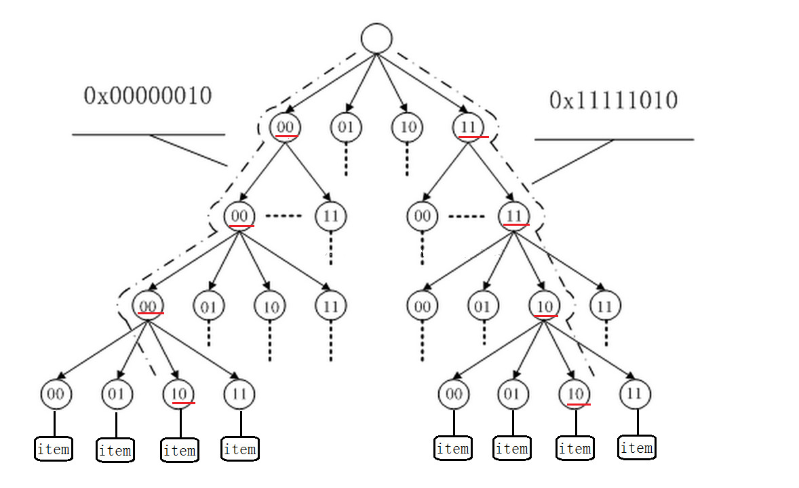

# Redis源码文件清单

> Redis（Remote Dictionary Server 远程字典服务）是一个开源的使用ANSI [C语言](https://baike.baidu.com/item/C语言)编写、支持网络、可基于内存亦可持久化的日志型、Key-Value[数据库](https://baike.baidu.com/item/数据库/103728)，并提供多种语言的API。

# 主程序(服务端与客户端)

- redis.c 
   - redis服务端启动程序

- redis_cli.c
  - redis客户端程序启动程序

# 数据结构(DataStruct)

- sds.c
  - 用于对字符串的定义，最基础的数据结构
- dict.c 
  - 字典dict数据结构实现，主要对于内存中的hash进行管理
- adlist.c 
  - 用于对list的定义，它是个**双向链表**结构 
- ziplist.c 
  - 压缩列表ziplist数据结构实现，ziplist是为了节省列表空间而设计一种特殊编码方式，是一个类似于list的存储对象。它的原理类似于zipmap。
- quicklist.c
  - 新加了list结构，以ziplist为基础
- sparkline.c
  -  一个拥有sample列表的序列

- zipmap.c  
  - 压缩字典zipmap数据结构实现，zipmap是为了节省哈希表空间而设计一种特殊编码方式

- intset.c
  - 整数集合

# 指令操作

- t_hash.c
  - Hash相关的操作,主要是Server/Client中的应答操作。主要通过redisObject进行类型转换。
- t_list.c
  - List相关操作,主要是Server/Client中的应答操作。主要通过redisObject进行类型转换。
- t_set.c
  - Set相关操作,主要是Server/Client中的应答操作。主要通过redisObject进行类型转换。
- t_stream.c
  - Stream相关操作(5.x之后),主要是Server/Client中的应答操作。主要通过redisObject进行类型转换。
- t_string.c
  - String相关操作,主要是Server/Client中的应答操作。主要通过redisObject进行类型转换。
- t_zset.c
  - zset相关操作,主要是Server/Client中的应答操作。主要通过redisObject进行类型转换。

# 事件库(AE)

- ae.c
  - redis I/O模型
- ae_epoll.c
  - epoll I/O模型实现
- ae_evport.c
  - evport I/O模型实现
- ae_kqueue.c
  - kqueue I/O模型实现
- ae_select.c
  - select I/O模型实现

# 内存管理(malloc)

> 关于Redis的内存分配的封装实现。Redis并没有自己实现内存池，没有在标准的系统内存分配器上再加上自己的东西。所以系统内存分配器的性能及碎片率会对Redis造成一些性能上的影响。
>
> 常见的内存分配有：jemalloc,tcmalloc,libc等

- zmalloc.c
  - 对c语言中的malloc简单包装。仅仅是精确的记录的已经分配的内存，基本没有其它多余的扩展。
- sdsalloc.h
- rax_malloc.h
- listpack_malloc.h

# 网络连接

> networing.c依赖于connection.c,而connection.c依赖于anet.c

- anet.c
  -  作为Server/Client通信的基础封装

- networking.c 
  - 网络协议传输方法定义相关的都放在这个文件里面了。

- connection.c
  - 连接封装，相当于Java语言networking编程中的channel
- connhelpers.h

# 哨兵(sentinel)

- sentinel.c
  - 哨兵模式实现高可用

# 集群(Cluster)

- cluster.c

  - 3.0之后，集群模式实现

- rax.c

  Redis基数树。一种保存长整形的算法。

  - 对于长整型数据的映射，如何解决Hash冲突和Hash表大小的设计是一个很头疼的问题。
  - radix树就是针对这种稀疏的长整型数据查找，能快速且节省空间地完成映射。借助于Radix树，我们可以实现对于长整型数据类型的路由。
  - 利用radix树可以根据一个长整型（比如一个长ID）快速查找到其对应的对象指针。这比用hash映射来的简单，也更节省空间，使用hash映射hash函数难以设计，不恰当的hash函数可能增大冲突，或浪费空间。
  - radix tree是一种多叉搜索树，树的叶子结点是实际的数据条目。每个结点有一个固定的指针指向子结点（每个指针称为槽slot，n为划分的基的大小）
  
  
  
  >  Redis实现了不定长压缩前缀的radix tree，用在集群模式下存储slot对应的的所有key信息。


# 数据库(RDB)

- db.c
  - 数据库实现
- config.c 
  - 用于将配置文件redis.conf文件中的配置读取出来的属性通过程序放到server对象中。

#  主从复制(Replication)

> ```c
> 具体的指令调用时“networking->readQueryFromClient”完成Relication触发。同理AOF也一样
> ```

- replication.c
  - 用于主从数据库的复制操作的实现。从而实现redis读写分离。

# 事务处理(Transaction)

- multi.c
  - 用于事务处理操作。

# 持久化备份(AOF和RDB)

> Redis提供了两种备份机制，AOF和RDB:  
>
> Redis的AOF机制有点类似于Mysql binlog，是Redis的提供的一种持久化方式（另一种是RDB），它会将所有的写命令按照一定频率(no, always, every seconds)写入到日志文件中，当Redis停机重启后恢复数据库。
>
> * save/bgsave命令，bgsave另外fork一个进程，子进程完成后signal父进程，父进程wait3()子进程，服务器能继续处理客户端的命令请求；
>
> * aof持久化优先于rdb持久化载入，且rdbload()中为互斥的；
>
> * save/bgsave在运行期间是互斥的；
>
> * bgrewirteaof和bgsave命令也是互斥的；
>
> * 自动间隔性保存：save period mod_times:表示在period间隔内有多少次mod_times触发bgsave命令;

- **aof.c**
  - 全称为append only file，作用就是记录每次的写操作,在遇到断电等问题时可以用它来恢复数据库状态。


> 如果开启了AOF，具体的指令调用时“networking->readQueryFromClient”完成Relication触发。因此每执行一条指令就需要执行一个AOF相关函数(不一定是真实写到AOF文件中，可能是BUFFER中，但一定会执行)。

- **rdb.c**
  - 对于Redis本地数据库的相关操作，默认文件是dump.rdb（通过配置文件获得），包括的操作包括保存，移除，查询等等。
  - 

> rdb通常由命令bgsave或save或者serverCron()定时触发，serverCron()触发指当符合了设置的RDB规则时就开始RDB.
>
> ```
> save 900 1   服务器在900秒之内，对数据库进行至少1次修改
> save 300 10 服务器在300秒之内，对数据库进行至少10次修改
> save 60 10000 服务器在60秒之内，对数据库进行至少10000次修改
> ```

从上面可知，AOF安全性可靠性高于RDB,但AOF相对于RDB来说效率慢，体积大。

# 地理位置(geo)

>  GeoHash将二维的经纬度转换成字符串 。 Redis3.2版本提供，支持存储地理位置信息用来实现诸如附近位置、摇一摇这类依赖于地理位置信息的功能.geo的数据类型为zset 。

- geo.c
- geohash.c
- geohash_helper.c
- gopher.c

- 

# 流(Stream)

> Redis5之后 

- stream.h
- lolwut.c
- lolwut5.c
- lolwut6.c
- listpack.c

# IO模块(Rio)

> Reids内部封装了一个I/O层，称之为rio

- rio.c redis
  - 定义的一个I/O类

- syncio.c
  - 用于同步Socket和文件I/O操作。

# 访问权限控制(ACL)

>  Access Control List（访问控制列表）的缩写 

- acl.c

# 发布订阅模式(PUB/SUB)

- pubsub.c 
  - 用于订阅模式的实现，有点类似于Client广播发送的方式。

# 封装类(Wrapper)

- hyperloglog.c 
  
  - `HyperLogLog`，简称为`HLL`，它是 `LogLog` 算法的升级版，作用是能够提供不精确的去重计数。存在以下的特点：
    - 代码实现较难。
    - 能够使用极少的内存来统计巨量的数据，在 `Redis` 中实现的 `HyperLogLog`，只需要`12K`内存就能统计`2^64`个数据。
    - 计数存在一定的误差，误差率整体较低。标准误差为 0.81% 。
    - 误差可以被设置`辅助计算因子`进行降低。
  
  > 参考资料：https://www.cnblogs.com/linguanh/p/10460421.html
- latency.c 
  
  - 延迟监控框架，可参考[Redis延迟监控框架](http://www.redis.cn/topics/latency-monitor.html)。redis在2.8.13版本引入了latency monitoring，这里主要是监控latency spikes(`延时毛刺`)。它基于事件机制进行监控，command事件是监控命令执行latency，fast-command事件是监控时间复杂度为O(1)及O(logN)命令的latency，fork事件则监控redis执行系统调用fork(2)的latency。
- 5.migrate.c 
  
  - 命令迁移类，包括命令的还原迁移等
- notify.c 
  
  - 通知类
- object.c 
  
  -  用于创建和释放redisObject对象
- pqsort.c  
  
  - 排序算法类
- slowlog.c 
  
  - 一种日志类型的，与hyperloglog.c类似，在2.2.12版本引入。用于**记录超过指定执行时间的命令**，这个执行时间不包括诸如与客户端通信的IO操作耗时，是实实在在的命令执行的耗时
- sort.c 
  
  - 排序算法类，与pqsort.c使用的场景不同
- tls.c
  
  -  安全传输协议实现 

# 模块化(Module)

- module.c
- redismodule.h

> Redis自4.0版本之后便支持了模块扩展功能, Redis推荐开发人员通过引入redismodule.h, 来调用指定接口来支持扩展, 其中要求实现程序必须实现RedisModule_OnLoad方法, 该方法主要加载模块, 注册相应的api, 对context上下文注入

使用方式 ：

1、用户扩展模块需要通过配置文件指定需要加载的链接库(redis.conf配置文件)

> ```properties
> # loadmodule /path/to/my_module.so
> # loadmodule /path/to/other_module.so
> ```

2、生成so文件

> 动态库需要用户自己去编译生成, 在编译之前需要将指定的module引入redismodule.h头文件, 最简单的方式是直接将源文件拉入modules下, 修改MakeFile文件并执行make编译

# 后台线程(BIO)

- bio.c

  - BIO即background I/O service，后台I/O服务，是redis的aof持久化后台服务。redis把阻塞的同步I/O操作交给后台I/O服务来完成：close和fsync。

  - **close加入BIO的原因**

    1.如果fd是特定文件描述符的最后一份拷贝，那么文件描述符相关的资源会被释放。

    2.如果fd是最后一个引用文件描述符的，并且文件描述符之前已经使用unlink进行删除，那么文件会被删除。

    资源释放和文件删除是非常慢的，会阻塞服务器

    **fsync加入BIO的原因**

    把内存中修改的文件数据同步到磁盘。调用者将被阻塞至磁盘报告同步完成。

    **BIO的设计**

    目前有两种任务：fsync和close。每种任务一个队列和一个线程。
  
- lazyfree.c

  - 在具体的close过程中，是通过调用lazyfree.c实现的。

# 算法相关

**LZF压缩算法 **

- lzf.h
- lzf_c.c
- lzf_d.c
- lzfP.h
  - 对 lzf.h 和 lzfP.h 的合并

**SHA缩算法 **

> SHA安全散列算法SHA （Secure Hash Algorithm，SHA）

- sha1.c
- sha1.h
- sha256.c
- sha256.h

**CRC循环冗余校验 **

- crc16.c
- crc16_slottable.h
- crc64.c
- crc64.h

# 工具类

- bitops.c 
  - 位操作相关类
- endianconv.c 
  - 高低位转换，不同系统，高低位顺序不同
- help.h  
  - 辅助于命令的提示信息
- rand.c
  -  用于产生随机数
- util.c 
  -  通用工具方法

# 调试/测试

- memtest.c 
  - 内存检测
- redis_benchmark.c 
  - 用于redis性能测试的实现。
- redis_check_aof.c 
  - 用于更新日志检查的实现。
- redis_check_dump.c 
  - 用于本地数据库检查的实现。
- testhelp.c 
  - 一个C风格的小型测试框架。
- debug.c 
  - 用于调试时使用
- debugmacro.h

# 脚本(LUA)

- scripting.c
  - 主要是处理Lua脚本相关

# 其它

## 基本信息

- version.h
  - 定义Redis的版本号
- asciilogo.c
  -  redis启动时logo显示

## 系统兼容

- fmacros.h 
  - 兼容Mac系统下的问题
- solarisfixes.h 
  - 兼容solary下的问题

## 未分类

- atomicvar.h
  - 原子计数器
- blocked.c
- childinfo.c
- defrag.c
- evict.c
- expire.c
- 
- localtime.c
- mkreleasehdr.sh
- redis-trib.rb
- redisassert.h
- setproctitle.c
- siphash.c
- timeout.c
- tracking.c
- valgrind.sup
- release.c
  - 用于发步时使用