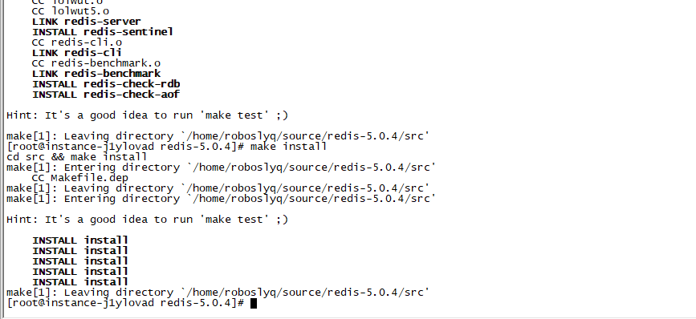

# 深入理解Redis

## 第一篇 应用篇

### Redis安装

#### Linux安装

##### **下载安装包**

根据自己的需要，去官网选择相应的版本,我就下载了稳定的5.0.4版本(redis中文网)的:

> 1. $ wget http://download.redis.io/releases/redis-5.0.4.tar.gz
> 2. $ tar xzf redis-5.0.4.tar.gz
> 3. $ cd redis-5.0.4
> 4. $ make



##### 修改配置

> 监听端口，如果不修改就不能外网访问(我只是在本机上使用相关命令，此参数暂时不修改)
>
> bind 127.0.0.1
>
> 后台运行修改为yes 
>
> daemonize yes

##### 启动redis

> [root@instance-j1ylovad redis-5.0.4]# cd src/
> [root@instance-j1ylovad src]# ./redis-server ../redis.conf 
> 27908:C 19 May 2020 23:30:58.828 # oO0OoO0OoO0Oo Redis is starting oO0OoO0OoO0Oo
> 27908:C 19 May 2020 23:30:58.828 # Redis version=5.0.4, bits=64, commit=00000000, modified=0, pid=27908, just started
> 27908:C 19 May 2020 23:30:58.828 # Configuration loaded

##### 测试redis

> [roboslyq@instance-j1ylovad src]$ ./redis-cli 
> 127.0.0.1:6379> set foo bar
> OK
> 127.0.0.1:6379> get foo
> "bar"
> 127.0.0.1:6379> 

命令可以正常使用。即表示安装成功。我们可以继续学习相关指令的使用了。

### 初级应用

#### 基础命令

- **help **

  - 命令说明：帮助命令,可以查看具体指令怎么使用。

  - 命令格式: `help command`（最常用）

  - 示例:

    - ```sh
      127.0.0.1:6379> help set
      
        SET key value [expiration EX seconds|PX milliseconds] [NX|XX]
        summary: Set the string value of a key
        since: 1.0.0
        group: string
      
      127.0.0.1:6379> help lpush
      
        LPUSH key value [value ...]
        summary: Prepend one or multiple values to a list
        since: 1.0.0
        group: list
      ```


#### String

> 以下命令表格来自于[redis中文网](https://www.redis.net.cn/)

| 命令                                                         | 描述                                                         |
| :----------------------------------------------------------- | :----------------------------------------------------------- |
| [Redis Setnx 命令](https://www.redis.net.cn/order/3552.html) | 只有在 key 不存在时设置 key 的值。                           |
| [Redis Getrange 命令](https://www.redis.net.cn/order/3546.html) | 返回 key 中字符串值的子字符                                  |
| [Redis Mset 命令](https://www.redis.net.cn/order/3555.html)  | 同时设置一个或多个 key-value 对。                            |
| [Redis Setex 命令](https://www.redis.net.cn/order/3551.html) | 将值 value 关联到 key ，并将 key 的过期时间设为 seconds (以秒为单位)。 |
| [Redis SET 命令](https://www.redis.net.cn/order/3544.html)   | 设置指定 key 的值                                            |
| [Redis Get 命令](https://www.redis.net.cn/order/3545.html)   | 获取指定 key 的值。                                          |
| [Redis Getbit 命令](https://www.redis.net.cn/order/3548.html) | 对 key 所储存的字符串值，获取指定偏移量上的位(bit)。         |
| [Redis Setbit 命令](https://www.redis.net.cn/order/3550.html) | 对 key 所储存的字符串值，设置或清除指定偏移量上的位(bit)。   |
| [Redis Decr 命令](https://www.redis.net.cn/order/3561.html)  | 将 key 中储存的数字值减一。                                  |
| [Redis Decrby 命令](https://www.redis.net.cn/order/3562.html) | key 所储存的值减去给定的减量值（decrement） 。               |
| [Redis Strlen 命令](https://www.redis.net.cn/order/3554.html) | 返回 key 所储存的字符串值的长度。                            |
| [Redis Msetnx 命令](https://www.redis.net.cn/order/3556.html) | 同时设置一个或多个 key-value 对，当且仅当所有给定 key 都不存在。 |
| [Redis Incrby 命令](https://www.redis.net.cn/order/3559.html) | 将 key 所储存的值加上给定的增量值（increment） 。            |
| [Redis Incrbyfloat 命令](https://www.redis.net.cn/order/3560.html) | 将 key 所储存的值加上给定的浮点增量值（increment） 。        |
| [Redis Setrange 命令](https://www.redis.net.cn/order/3553.html) | 用 value 参数覆写给定 key 所储存的字符串值，从偏移量 offset 开始。 |
| [Redis Psetex 命令](https://www.redis.net.cn/order/3557.html) | 这个命令和 SETEX 命令相似，但它以毫秒为单位设置 key 的生存时间，而不是像 SETEX 命令那样，以秒为单位。 |
| [Redis Append 命令](https://www.redis.net.cn/order/3563.html) | 如果 key 已经存在并且是一个字符串， APPEND 命令将 value 追加到 key 原来的值的末尾。 |
| [Redis Getset 命令](https://www.redis.net.cn/order/3547.html) | 将给定 key 的值设为 value ，并返回 key 的旧值(old value)。   |
| [Redis Mget 命令](https://www.redis.net.cn/order/3549.html)  | 获取所有(一个或多个)给定 key 的值。                          |
| [Redis Incr 命令](https://www.redis.net.cn/order/3558.html)  | 将 key 中储存的数字值增一。                                  |

- **set**

  - 命令说明：set,最常用的命令之一

  - 使用场景：最常用的场景，设置一个值，不存在就新创建，存在就更新

  - 示例:

    - ```sh
      127.0.0.1:6379> set a b
      OK
      127.0.0.1:6379> set c d
      OK
      127.0.0.1:6379> get a
      "b"
      127.0.0.1:6379> set a c
      OK
      127.0.0.1:6379> get a
      "c"
      ```

    - 第一次`get a`的值是"b"，在调用`set a c`之后再调用`get a `命令，返回值是"c"。表明已经更新

  - 示例2：设置过期时间

    - ```
      127.0.0.1:6379> set key 100 ex 10
      OK
      127.0.0.1:6379> get key
      "100"
      127.0.0.1:6379> get key
      "100"
      127.0.0.1:6379> get key
      "100"
      127.0.0.1:6379> get key
      "100"
      127.0.0.1:6379> get key
      (nil)
      127.0.0.1:6379> 
      ```

- **get**

  - 命令说明：get,最常用的命令之一

  - 使用场景：最常用的场景，根据指定的key获取对应的value

  - 示例:

    - ```sh
      127.0.0.1:6379> get x
      (nil)
      127.0.0.1:6379> set a b 
      OK
      127.0.0.1:6379> get a
      "b"
      ```

    - 当对应的key不存在时，返回nil。

- **setnx**

  - 命令说明：Set the value of a key, only if the key does not exist，不存在时插入

  - 使用场景：锁的实现，使用Key作为锁，当setnx失败时，表明已经有其它资源已经获得了锁。

  - 示例：

    - ```sh
      127.0.0.1:6379> setnx lock1 key1
      (integer) 1
      127.0.0.1:6379> setnx lock1 key2
      (integer) 0
      127.0.0.1:6379> get lock1
      "key1"
      ```

    - 第一次setnx时，因为lock1这个key不存在，所以能setnx成功，redis返回1。第2次setnx 时，因为此时lock1已经存在了，所以返回0，即setnx失败。当然，我们可以通过get命令来获取对应lock1的值。

- **mset**

  - 命令说明: : Set multiple keys to multiple values,即一次性设置多个Key-value

  - 使用场景：多个key-value次性执行，而不需要发送多个命令

  - 示例:

    - ```shell
      127.0.0.1:6379> mset key1 v1 key2 v2 key3 v3
      OK
      127.0.0.1:6379> get key1
      "v1"
      127.0.0.1:6379> get key2
      "v2"
      127.0.0.1:6379> get key3
      "v3"
      ```

    - 说明后面的参数为key-value对。如上面的key1,key2,key3都是Key。而v1,v2,v3分别对应其值。

- **decr**

  - 命令说明：Decrement the integer value of a key by one，递减

  - 场景：每次减1，可以用于库存等

  - 示例:

    - ```sh
      127.0.0.1:6379> set count 100
      OK
      127.0.0.1:6379> decr count
      (integer) 99
      127.0.0.1:6379> decr count
      (integer) 98
      127.0.0.1:637
      ```

    - 初始化count=100,每执行一次`decr count`，对应的值就减1

- **incr** 

  - 命令说明：Increment the integer value of a key by one,增加

  - 场景：每次加1，可以用于计数

  - 示例

    - ```
      127.0.0.1:6379> incr count
      (integer) 101
      127.0.0.1:6379> incr count
      (integer) 102
      127.0.0.1:6379> incr count
      (integer) 103
      127.0.0.1:6379> incr count
      (integer) 104
      ```

    - 初始化count=100,每执行一次`incr count`，对应的值就加1

- **setex**

  - 命令说明：Set the value and expiration of a key

  - 场景：与set类型

  - 示例:

    - ```sh
      127.0.0.1:6379> setex key1 5 hello
      OK
      127.0.0.1:6379> get key1
      "hello"
      127.0.0.1:6379> get key1
      (nil)
      127.0.0.1:6379> 
      ```

#### Hash

#### Redis 哈希(Hash) 命令

| 命令                                                         | 描述                                                     |
| :----------------------------------------------------------- | :------------------------------------------------------- |
| [Redis Hmset 命令](https://www.redis.net.cn/order/3573.html) | 同时将多个 field-value (域-值)对设置到哈希表 key 中。    |
| [Redis Hmget 命令](https://www.redis.net.cn/order/3572.html) | 获取所有给定字段的值                                     |
| [Redis Hset 命令](https://www.redis.net.cn/order/3574.html)  | 将哈希表 key 中的字段 field 的值设为 value 。            |
| [Redis Hgetall 命令](https://www.redis.net.cn/order/3567.html) | 获取在哈希表中指定 key 的所有字段和值                    |
| [Redis Hget 命令](https://www.redis.net.cn/order/3566.html)  | 获取存储在哈希表中指定字段的值/td>                       |
| [Redis Hexists 命令](https://www.redis.net.cn/order/3565.html) | 查看哈希表 key 中，指定的字段是否存在。                  |
| [Redis Hincrby 命令](https://www.redis.net.cn/order/3568.html) | 为哈希表 key 中的指定字段的整数值加上增量 increment 。   |
| [Redis Hlen 命令](https://www.redis.net.cn/order/3571.html)  | 获取哈希表中字段的数量                                   |
| [Redis Hdel 命令](https://www.redis.net.cn/order/3564.html)  | 删除一个或多个哈希表字段                                 |
| [Redis Hvals 命令](https://www.redis.net.cn/order/3576.html) | 获取哈希表中所有值                                       |
| [Redis Hincrbyfloat 命令](https://www.redis.net.cn/order/3569.html) | 为哈希表 key 中的指定字段的浮点数值加上增量 increment 。 |
| [Redis Hkeys 命令](https://www.redis.net.cn/order/3570.html) | 获取所有哈希表中的字段                                   |
| [Redis Hsetnx 命令](https://www.redis.net.cn/order/3575.html) | 只有在字段 field 不存在时，设置哈希表字段的值。          |

- **HSET**

  - 命令说明： Set the string value of a hash field。将一个string的值设置到Hash中

  - 命令格式：  HSET key field value ...

  - 使用场景: HashMap

  - 示例：

    - ```sh
      127.0.0.1:6379> hset user name luoyq age 20
      (integer) 2
      127.0.0.1:6379> hget user name
      "luoyq"
      127.0.0.1:6379> hset user name zhangsa
      (integer) 0
      127.0.0.1:6379> hget user name
      "zhangsa"
      127.0.0.1:6379> hget user age
      "20"
      ```

    - `hset user name luoyq age 20`创建一个hash表，表名是user，并向其中存中name=luoyq,age=20的两对key-value值。

- **HGET**

  - 命令说明：Get the value of a hash field。将一个string的值设置到Hash中

  - 命令格式：  HgET key field

  - 使用场景: HashMap

  - 示例：

    - ```sh
      127.0.0.1:6379> hset user name luoyq age 20
      (integer) 2
      127.0.0.1:6379> hget user name
      "luoyq"
      127.0.0.1:6379> hset user name zhangsa
      (integer) 0
      127.0.0.1:6379> hget user name
      "zhangsa"
      127.0.0.1:6379> hget user age
      "20"
      ```

    - `hset user name luoyq age 20`创建一个hash表，表名是user，并向其中存中name=luoyq,age=20的两对key-value值。

- **HKEYS**

  - 命令说明：Get all the fields in a hash。返回指定Hash表中所有的Key。

  - 命令格式：  HKEYS key

  - 使用场景: HashMap

  - 示例：

    - ```sh
      127.0.0.1:6379> hset user name luoyq age 20
      (integer) 0
      127.0.0.1:6379> hkeys user
      1) "name"
      2) "age"
      127.0.0.1:6379> 
      ```

- **HEXISTS**

  - 命令说明： Determine if a hash field exists。判断Hash表中是否存在对应的key。

  - 命令格式：  **HEXISTS** key

  - 使用场景: HashMap

  - 示例：

    - ```sh
      127.0.0.1:6379> hset user name luoyq age 20
      (integer) 0
      127.0.0.1:6379> hkeys user
      1) "name"
      2) "age"
      127.0.0.1:6379> hexists user name
      (integer) 1
      ```

    - 

#### Set

#### Zset

#### List

### 中级应用

#### Stream

#### Geo

#### Hyperloglog

### 高级应用

#### 事务

#### 分布式锁

#### LUA脚本

#### 消息队列

>  1、 使用list数据结构，消息发布者push数据，多个消息订阅者通过阻塞线程pop数据，以此提供简单的消息队列能力 
>
> 2、专门的更强大的Stream数据结构

####  计数器 

>  使用Redis原子操作，用于社交网络的转发数，评论数，粉丝数，关注数等 

####  排行榜 

>  使用zset数据结构，进行排行榜计算 

####  实时系统

>  使用Redis位图的功能实现布隆过滤器，进而实现垃圾邮件处理系统 


## 第二篇 原理篇

> 调度环境搭建，源码分析

## 第三篇 运维篇

### 主从

### CLUSTER集群

### AOF与RDB

### 慢查询

### 性能调优


